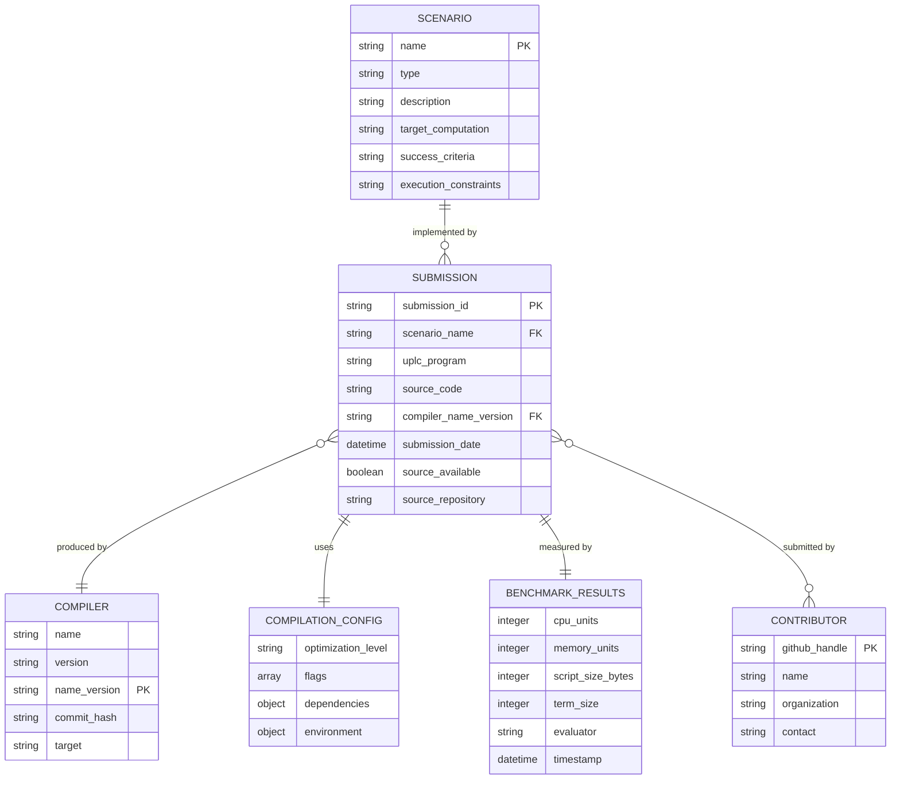

# CAPE Framework Domain Model

## Overview

This document describes the core domain entities and their relationships within the CAPE (Comparative Artifact Performance Evaluation) framework. CAPE is designed to benchmark the on-chain performance of UPLC programs produced by different compilers in the Cardano ecosystem.

## Core Domain Entities

### 1. Scenario

A **Scenario** represents an abstract benchmark specification that defines a computational task to be implemented by various compilers.

**Properties:**

- `name`: Unique identifier (e.g., "fibonacci", "escrow")
- `type`: Either "synthetic" (algorithmic) or "real-world" (smart contract)
- `description`: Natural language specification of the computational task
- `target_computation`: The specific computation to be performed
- `success_criteria`: How to determine if an implementation is correct
- `execution_constraints`: Any constraints on the implementation

**Examples:**

- Fibonacci(25) - synthetic recursive algorithm
- Two-Party Escrow - real-world smart contract
- Streaming Payments - real-world smart contract

### 2. Implementation

An **Implementation** is an abstract concept representing the realization of a Scenario. In practice, this is always materialized as a **Submission** (see below).

**Note:** This entity exists conceptually but is always represented concretely as a Submission with full metadata.

### 3. Submission (Implementation)

A **Submission** represents a complete implementation of a scenario by a specific compiler, including the UPLC code, metadata, and performance measurements. This is the primary entity that embodies an implementation.

**Properties:**

- `scenario`: The scenario being implemented
- `uplc_program`: The compiled UPLC code
- `source_code`: Optional original source code
- `compiler_info`: Information about the compiler used
- `compilation_config`: Configuration used during compilation
- `benchmark_results`: Performance measurements
- `contributors_info`: Information about who submitted this implementation
- `submission_id`: Unique identifier (format: `{compiler}_{version}_{contributor}`)
- `submission_date`: When the submission was created

**Structure:**

```
submissions/{scenario}/{compiler}_{version}_{contributor}/
├── {scenario}.uplc          # The UPLC implementation
├── metadata.json            # Compiler and contributor metadata
├── metrics.json             # Performance measurements
└── README.md               # Implementation notes
```

**Constraints:**

- Must be fully-applied (parameters baked into the script)
- Must successfully execute within budget limits
- Must produce the expected result
- Each submission must be unique in terms of UPLC program content or compilation configuration, even when using the same compiler and scenario

### 4. Compiler

A **Compiler** represents a specific version of a tool that can transform source code into UPLC programs. In the CAPE framework, different versions of the same compiler are treated as distinct entities (e.g., "Plinth 1.51" and "Plinth 1.52" are considered two different compilers).

**Properties:**

- `name`: Compiler name (e.g., "Aiken", "Plutarch", "Plinth")
- `version`: Semantic version string (e.g., "1.52", "2.1.0")
- `commit_hash`: Specific commit identifier for reproducibility
- `target`: Always "uplc" for this framework

**Identity:** A compiler is uniquely identified by the combination of `name` and `version`. The same tool at different versions constitutes different compilers for benchmarking purposes.

### 5. Compilation Configuration

**Compilation Configuration** captures all settings that influence the compiler output.

**Properties:**

- `optimization_level`: Level of optimization applied
- `flags`: Command-line flags or options used
- `dependencies`: Package dependencies and their versions
- `environment`: Additional environment-specific settings

### 6. Benchmark Results

**Benchmark Results** contain the measured performance metrics from executing a Submission.

**Properties:**

- `cpu_units`: Computational cost in CPU units
- `memory_units`: Memory consumption in memory units
- `script_size_bytes`: Size of the UPLC script in bytes
- `term_size`: Size of the UPLC term representation
- `execution_environment`: Information about the evaluator used
- `timestamp`: When the measurement was taken
- `measurement_method`: How the measurement was obtained

### 7. Contributor

A **Contributor** represents a person or organization submitting implementations.

**Properties:**

- `name`: Optional contributor name
- `organization`: Optional organization affiliation
- `contact`: Optional contact information
- `github_handle`: GitHub username (used in submission naming)

## Entity Relationships



## Key Relationships

1. **Scenario to Submission**: One-to-Many
   - A scenario can have multiple submissions from different compilers
   - Each submission implements exactly one scenario

2. **Compiler to Submission**: One-to-Many
   - A specific compiler version can produce submissions for multiple scenarios
   - A specific compiler version can have multiple submissions for the same scenario from different contributors, as long as the UPLC programs or compilation configurations differ
   - Each submission is produced by exactly one compiler name-version combination
   - Different versions of the same compiler tool are treated as distinct entities

3. **Contributor to Submission**: Many-to-Many
   - A contributor can submit multiple implementations for different scenarios
   - A contributor can submit multiple implementations for the same scenario using different compilers
   - Multiple contributors can submit implementations using the same compiler for the same scenario, provided the implementations differ in their UPLC programs or compilation configurations
   - Each submission can be associated with one or more contributors (to support collaborative work)

### Multiple Submissions per Compiler

The framework allows multiple contributors to submit different implementations using the same compiler for the same scenario. This enables exploration of:

- **Different compilation configurations**: Various optimization levels, flags, or dependency versions
- **Different source code approaches**: Alternative algorithms or implementation strategies that compile to different UPLC programs
- **Configuration experimentation**: Testing how different compiler settings affect performance

Each submission is uniquely identified by its `submission_id` (format: `{compiler}_{version}_{contributor}`) and must contain either:

- A different UPLC program (resulting from different source code or compilation approach), or
- A different compilation configuration (even if the source code is similar)

This design encourages experimentation and allows the community to discover optimal configurations and implementation approaches for each compiler.

## Workflow and Lifecycle

### 1. Benchmark Definition Phase

1. A new **Benchmark** is defined using the template: `cape benchmark new <benchmark-name>`
2. The benchmark specification is completed with requirements, constraints, and test cases
3. The Plutus Core team creates a reference **Submission** using Plinth
4. The benchmark is published to invite community participation

### 2. Implementation Phase

1. Compiler teams create **Submissions** implementing the benchmark
2. Each submission includes complete **Compilation Configuration**
3. Teams measure **Benchmark Results** using their tooling

### 3. Submission Phase

1. Teams finalize their **Submission** using the standardized structure
2. **Metadata** includes all compiler and contributor information
3. Submissions are version-controlled in the repository

### 4. Comparison Phase

1. **Benchmark Results** are compared across submissions
2. Performance characteristics are analyzed
3. Optimization opportunities are identified

## Domain Invariants

### Data Integrity

- All UPLC programs must be valid and executable
- Benchmark results must be reproducible
- Metadata must be complete and accurate
- Submissions using the same compiler and scenario must differ in either the UPLC program or compilation configuration

### Naming Conventions

- Scenario names: lowercase, underscore-separated (e.g., "fibonacci", "two_party_escrow")
- Submission IDs: `{compiler}_{version}_{contributor}` format
- File names: scenario name + appropriate extension

### Performance Constraints

- All submissions must complete within execution budget limits
- Results must be deterministic and reproducible
- Measurements must use standardized evaluation environment

## Extension Points

The domain model is designed to support future extensions:

1. **New Scenario Types**: The framework can accommodate both synthetic and real-world scenarios
2. **Additional Metrics**: New performance measurements can be added to Benchmark Results
3. **Compiler Support**: New compilers and new versions of existing compilers can participate without framework changes
4. **Evaluation Methods**: Different measurement approaches can be supported

## Related Documentation

- [Scenario Specifications](../scenarios/) - Detailed specifications for each benchmark scenario
- [Submission Guidelines](../CONTRIBUTING.md) - How to create and submit implementations
- [Architecture Decision Records](./adr/) - Design decisions and rationale

## Directory Structure

The CAPE framework uses the following top-level directory organization:

```
/
├── scenarios/           # Benchmark scenario specifications
│   ├── TEMPLATE/       # Template files for new benchmarks
│   └── {benchmark}.md   # Benchmark definition files
├── submissions/         # All submission implementations
│   ├── TEMPLATE/       # Template files for new submissions
│   └── {benchmark}/     # Submissions for a specific benchmark
│       └── {compiler}_{version}_{contributor}/  # Individual submissions
└── scripts/            # Framework tooling and utilities
```

**Key directories:**

- `scenarios/`: Contains specifications for benchmark scenarios
- `scenarios/TEMPLATE/`: Template files used when creating new benchmarks
- `submissions/`: Contains all implementation submissions organized by benchmark
- `submissions/TEMPLATE/`: Template files used when creating new submissions
- `submissions/{benchmark}/`: All submissions for a particular benchmark

## Framework Tools

The CAPE framework provides command-line tools for managing benchmarks and submissions.

See USAGE.md at the project root for the full CLI command reference.

### Benchmark Management

```bash
# List all available benchmarks
cape benchmark list

# Get detailed information about a specific benchmark
cape benchmark <benchmark-name>

# Create a new benchmark from template
cape benchmark new <benchmark-name>
```

### Submission Management

```bash
# List all submissions (or for a specific benchmark)
cape submission list [benchmark]

# Create a new submission
cape submission new <benchmark> <compiler> <version> <contributor>
```
