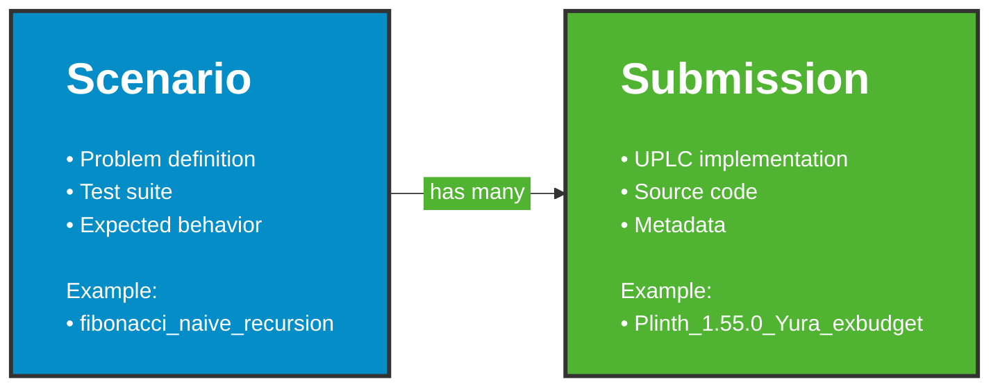
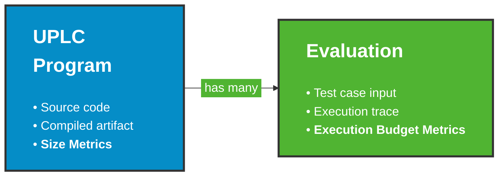

<div class="cover-logos">
  
</div>

<div class="cover-content">
  <h1 class="cover-main">UPLC-CAPE:</h1>
  <h1 class="cover-sub">Comparative Artifact</h1>
  <h1 class="cover-sub">Performance Evaluation</h1>

  <p class="cover-date">October 2025</p>
</div>

<!--
**Conference**: UPLC Conference
**Duration**: 60 minutes
**Format**: Presentation (30-35 min) + Hands-on Workshop (25-30 min)
-->

---
layout: center
---

## Agenda

1. Presentation **~30 min**
1. Hands-on part **~30 min**

---
layout: center
---

## Before we start...

**To save time on development environment initialization**

1. Clone the GitHub repository:<br> <strong class="black">github.com&nbsp;/&nbsp;IntersectMBO&nbsp;/&nbsp;UPLC-CAPE</strong>
1. Start the Nix dev shell:<br>
`nix develop` 

---
layout: center
---

## Multiplication Principle

**Every validator node runs your code independently**

- 3,000+ validator nodes on Cardano
- Each node executes **every script** in **every transaction**
- Your code runs thousands of times per transaction

<!--
**Opening hook:** "Imagine you've deployed a smart contract on Cardano. Every time someone uses it, 3,000+ validator nodes execute your code independently."

**Key emphasis:**

- This is the fundamental mental model for UPLC performance
- The decentralized nature is a feature, but it makes optimization critical

**Why this matters:**

In a decentralized network, you can't solve performance problems by adding more servers—every optimization matters because your code runs thousands of times per transaction.

**Transition:** "Now let's look at what this means for costs..."
-->

---
layout: center
---

## Cost is Multiplied

**Cost Model**

- Costs accrue per the on-chain cost model (CPU and memory units)
  ```
  Fee = (memory × 0.0577) + (CPU_steps × 0.0000721) lovelace
  ```
- A small inefficiency repeated 100 times can add millions of extra CPU units
- Unlike Web2: you can't "scale up servers" —  **every node pays the cost**

<!--
**The cost impact:**

- Unlike traditional software where inefficiency is linear, here it's multiplicative
- The formula shows memory and CPU both matter (different weights)
- Both resources contribute to the final transaction cost
- Every node pays the cost—you can't scale up servers

**Transition:** "Now let's see what these fees look like in practice..."
-->

---
layout: center
---

## Real Transaction Costs

- Simple transfers: ~**0.164 ADA**
- Script transactions: **0.5-2+ ADA**

<!--
**Key emphasis:**

- Make the economics concrete: script transactions cost 3-12x more than simple transfers
- This is the actual cost users pay today

**Transition:** "So what impact can optimization have on these costs?"
-->

---
layout: center
---

## Optimization Impact

- Typical optimization gains: **40-60% cost reduction**
- High-volume protocols: **$24k-$150k annual savings**

<!--
**Key emphasis:**

- For dApp developers: 40-60% reduction is realistic, not theoretical
- The economics are compelling

**Additional context if time permits:**

- Minswap example: 1M transactions/year × 0.02 ADA savings = $24k annually
- Developer ROI: 1-2 weeks optimization work = 400-900% first-year return

**Why this matters:**

Better optimization means lower fees for users and better user experience overall.

**Transition:** "But there's a hard ceiling on how much you can execute..."
-->

---
layout: center
---

## Hard Limits with Real Consequences

**Transaction Limits (Non-Negotiable)**

- Max memory: **14M units**
- Max CPU: **10B steps**
- Max script size: **16 KB**

<!--
**Key emphasis:**

- These aren't soft warnings or best practices—they're hard protocol limits
- These limits exist for network health (prevent DoS), but they constrain what you can build

**Practical guidance:**

All compiled output must fit within these bounds—test your worst-case execution paths to ensure you stay under the limits.

**Potential question:** "Can these limits change?"

- Answer: Yes, via governance/parameter updates, but they're currently stable. Don't count on them increasing soon.

**Transition:** "So what happens when you exceed these limits?"
-->

---
layout: center
---

## Hard Limits with Real Consequences

**What happens when you exceed these?**

<div v-click>

- ❌ Transaction fails
- ❌ Collateral forfeited
- ❌ No partial execution, no refunds

</div>

<!--
**Key emphasis:**

- Collateral forfeit is the critical point: users lose money if your script is too expensive
- No second chances, no partial execution, no refunds
- The consequences are immediate and harsh

**Why this matters:**

Unlike web applications that can crash gracefully, blockchain execution is all-or-nothing—scripts either pass all checks or fail completely, forfeiting user collateral.

**Bottom line:**

- Optimization isn't optional—it's required for execution
- This is the "stick" that makes performance critical

**Transition:** "Let's see a real-world example of optimization impact..."
-->

---
layout: center
---

## Real-World Impact: SundaeSwap

**13.8x throughput improvement** (V1 → V3)

- V1: 164 orders per transaction
- V3: 2,258 orders per transaction
- Rewrote validator logic + better compilation strategy (Aiken)

<!--
**Key emphasis:**

- This is the headline number: 13.8x is massive and memorable
- Same functionality, different implementation = order of magnitude difference
- This validates why benchmarking matters: you need to compare compilers objectively

**Additional context:**

- SundaeSwap V1 launch caused network congestion, required emergency parameter increases
- V3 solved this through better performance, not protocol changes
- This level of improvement isn't unusual—seen across multiple protocols

**Key takeaway:**

Optimization isn't micro-optimization—choosing the right toolchain and optimization strategy can deliver transformational performance improvements.

**Transition:** "This proves optimization matters. Now let's drive the point home..."
-->

---
layout: center
class: attention
---

## Key Takeaways

- Optimization isn't optional
- The language/compiler you choose matters

<!--
**Delivery:**

- Let both statements sink in
- Brief pause for emphasis
- These are key takeaways for all audiences

**Key emphasis:**

- The SundaeSwap example showed: same functionality, different implementation = 13.8x difference
- Optimization and toolchain choice have massive implications

**Key takeaway:**

The toolchain you choose has massive implications—optimization can deliver transformational improvements, not just incremental gains.

**Transition:** "So who should care about measuring UPLC performance? Let's break down the stakeholders..."
-->

---
layout: center
---

## Benchmarking Challenges

- **Reproducibility & Determinism** - same code, same results, every time
- **Source Code Transparency** - understand why the results are what they are
- **Technical Challenges** - abstract off-chain parts for complex validators
- **Usability Challenges** - easy to compare and lower barrier to contribution

<!--
- "Need exact same results regardless of who runs it, when, or where" 
"Critical for trust and validation"

**2. Source Code Transparency:**

- "Black box benchmarks don't teach anyone anything"
- "You need to see: here's the source, here's how it compiles, here's why it performs this way"
- "The mental model matters: developers need to connect source patterns to performance outcomes"

**3. Technical Challenges:**

- "Many validators aren't one-shot algorithms - they have state, multi-tx interactions"
- "Need to abstract the off-chain setup/interaction parts"

**4. Usability Challenges:**

- "Data needs to be comparable - apples to apples"
- "Present results in digestible format - not raw dumps"
- "Crowdsourcing: anyone should be able to contribute without being a benchmarking expert"

**Transition:** "So how does CAPE address these challenges? Let me introduce the framework..."
-->

---
layout: center
---

## Introducing UPLC-CAPE

<v-switch :unmount="true">
<template #0>

**CAPE = Comparative Artifact Performance Evaluation**

</template>
<template #1>

**CAPE = Cardano Application Performance Evaluation**

</template>
<template #2>

**Developed & maintained by the Plutus Core team**

- Unbiased, **fair field of play** for all compilers
- No favoritism, just objective measurement

</template>
<template #3>

**Focus on Writing Code, Not Measurement**

- `cape` command-line tool handles all the complexity
- Authors focus on: write code → compile to UPLC → submit
- Measurement, validation, aggregation handled automatically

</template>
<template #4>

**Same Environment as Mainnet**

- Uses **sandboxed CEK machine** (UPLC interpreter)
- Same implementation used by the latest release of the Cardano node
- Uses **latest cost model** deployed

</template>
<template #5>

**What's Included**

- **Scenarios**: Benchmark problems (growing set, open for contributions)
- **Tooling**: `cape` CLI for easy contribution workflow
- **Visualization**: Tables and graphs on the web for easy comparison

</template>
<template #6>

**Open & Community-Driven**

- Anyone can contribute scenarios or submissions
- Transparent, reproducible, collaborative

</template>
</v-switch>

<!--
**Important terminology note:**

- When we say "performance" in CAPE, we mean **effectiveness** broadly
- NOT wall clock time - we're measuring cost model units (CPU/memory), script size
- "Performance" = how efficient your UPLC code is within Cardano's execution model

**Key emphasis:**

- Spell out the acronym first - make it clear what CAPE stands for
- Emphasize the Plutus Core team backing - credibility and neutrality
- The "fair field of play" point is important - no one has an advantage

**CAPE acronym:**

- "CAPE stands for Cardano Application Performance Evaluation"
- "It's the official benchmarking framework for UPLC performance"

**Plutus Core team & neutrality:**

- "Developed and maintained by the Plutus Core team at IOG"
- "This isn't a vendor benchmark - it's unbiased infrastructure"
- "Fair field of play: everyone uses the same measurement methodology"

**Key emphasis:**

- Make it clear how much CAPE simplifies contribution
- Mainnet equivalence is crucial - results are real-world relevant

**Focus on writing code:**

- "Here's what CAPE does for you: you don't need to become a benchmarking expert"
- "Write your code, compile it to UPLC, submit it with the `cape` command"
- "CAPE handles: measurement, validation against test cases, metric aggregation"
- "This lowers the barrier - you can focus on what you're good at"

**Mainnet equivalence:**

- "CAPE uses the exact same CEK machine implementation that runs on Cardano mainnet"
- "It's sandboxed for safety, but it's the same interpreter your code will run on in production"
- "Uses the latest cost model from mainnet - you don't need to track cost model updates"
- "This means: CAPE results are real-world relevant, not theoretical"

**What's included:**

- "Scenarios: benchmark problems like fibonacci, factorial, list operations"
- "The set isn't huge yet, but it's growing - and open for contributions"
- "Tooling: the `cape` CLI guides you through the contribution process"
- "Visualization: results published on the web with tables and graphs for easy comparison"

**Open & community-driven:**

- "This is collaborative, not competitive"
- "Anyone can contribute new scenarios or submissions"
- "Everything is transparent and reproducible"

**Transition:** "Let me show you who benefits from CAPE..."
-->

---
layout: center
---

## Who Benefits

- **Compiler Authors**
- **dApp Developers**
- **New Developers**

<!--
**Compiler Authors:**
- Fixed algorithm scenarios isolate compiler optimization quality
- This is an opportunity to showcase and improve, not a ranking competition
- Learn from other compilers' optimization techniques

**dApp Developers:**
- CAPE is a repository of battle-tested validator patterns
- Study expert implementations to improve your own code
- Cross-pollination: techniques from one ecosystem inspire patterns in another

**New Developers:**
- Make informed toolchain decisions with objective performance data
- See trade-offs across compilers before investing time learning
- "Should you learn Plinth, Aiken, or OpShin?" - CAPE shows real-world differences
-->

---
layout: center
---

## CAPE Architecture: Core Entities



<!--
**Key emphasis:**

- This is the fundamental structure of CAPE
- Scenarios define "what to solve", submissions define "how to solve it"
- The one-to-many relationship enables comparison

**Scenario:**

- A scenario is a problem definition
- Contains: problem spec, test suite (cape-tests.json), expected behavior
- Examples: fibonacci, fibonacci_naive_recursion, factorial_naive_recursion
- Note: we use 'scenario' and 'benchmark' interchangeably

**Submission:**

- A submission is one implementation of a scenario uniquely identified by compiler name, version, contributor handle.
- Contains: compiled UPLC, source code, metadata, measured metrics
- Naming: {Compiler}_{version}_{contributor}
- Example: Plinth_1.11.0_yura means Plinth compiler version 1.11.0 by contributor yura

**The Relationship:**

- One scenario has many submissions
- Different compilers solving the same problem
- All validated against the same test suite

**Transition:** "Now let me show you how these entities work together in practice..."
-->

---
layout: center
---

## CAPE Workflow

<v-switch :unmount="true">
<template #0>


</template>
<template #1>

**Create a Scenario**

1. Choose type: **Fixed algorithm** or **Flexible**
1. Create scenario from a template with `cape benchmark new <name>`
1. Document the benchmark scenario in `<scenario>.md`
1. Create test suite in `cape-tests.json`

</template>
<template #2>

**Make a Submission**

1. Create project with sources (GitHub repo or local)
1. Compile your program to UPLC (the `<scenario>.uplc` file)
1. Create submission directory from a template with  
   `cape submission new <scenario>`
1. Fill in metadata, README

</template>
<template #3>

**Measure**

`cape` runs UPLC on CEK machine, collects metrics

1. Validate correctness `cape submission verify <path>`
1. Collect metrics `cape submission measure <path>`

</template>
<template #4>

**Preview results: Web Report**

CAPE generates report with tables and graphs

- Manual preview with `cape submission report`
- Automatic preview for PRs
- Published: https://intersectmbo.github.io/UPLC-CAPE/

</template>
</v-switch>

<!--
**Key points:**

- Fixed algorithm scenarios (`_naive_recursion`) test compiler optimization quality
- Flexible scenarios allow any approach - submissions converge on optimal implementation
- Authors focus on writing code; `cape` handles measurement, validation, and reporting
- All measurements deterministic and reproducible (same CEK machine as mainnet)

**Workflow summary:**

Create scenario → Write implementation → Submit → Automated measurement → HTML reports with comparison tables

**Transition:** "Now let's talk about what metrics we're actually measuring..."
-->

---
layout: center
---

## Key Metrics Explained

<v-switch :unmount="true">
<template #0>

1. **Raw Metrics**<br> Direct measurements from UPLC evaluation
2. **Derived Metrics**<br> Meaningful for dApp developers, calculated from raw metrics

</template>

<template #1>

**Raw Metrics** — &nbsp;Direct measurements from UPLC evaluation

- Script size:
  - CBOR/Flat encoding measured in bytes
  - Term size measured in AST nodes
- Execution budget:
  - CPU units
  - Memory units

</template>

<template #2>

**Derived Metrics** — &nbsp;are meaningful for dApp developers

- Transaction fees (lovelace/ADA)
- Budget utilization (% of tx/block limits)
- Capacity (scripts per tx/block)

</template>

<template #3>



</template>

<template #4>

**Aggregation Strategies**

For scenarios with multiple evaluations:

- `maximum` - Worst-case across all tests (used for capacity metrics)
- `sum` - Total across all tests (used for fee metrics)
- `minimum`, `median` - Best-case and middle values
- `sum_positive`, `sum_negative` - Success vs failure cases

</template>

<template #5>

**Trade-offs & Variants**

- Optimizations involve trade-offs: size vs speed, memory vs CPU
- **Variants** allow submissions to indicate which side of a trade-off is optimized for
- Example: "size-optimized" vs "budget-optimized" variants

</template>
</v-switch>

<!--
**Raw Metrics:**

- "These are direct outputs from running UPLC on the CEK machine"
- "Script size: on-chain storage size in bytes"
- "Term size: AST node count, complexity indicator"

**Derived Metrics:**

- "These translate raw measurements into real-world impact"
- "Execution fee: 'How much does it cost to run this?'"
- "Budget utilization: 'What percentage of transaction/block limits does this consume?'"
- "Capacity: 'How many of these can fit in a transaction or block?'"
- "These are calculated using Conway mainnet protocol parameters"

**Key emphasis:**

- Aggregation strategies have semantic meaning - not arbitrary choices
- Trade-offs are real, variants capture different optimization goals

**Aggregation strategies:**

- "`maximum` - Worst-case semantics"
- "Used for budget/capacity metrics because validators face adversarial inputs"
- "You need to handle the worst case, not just average case"
- "A validator cheap on average but expensive on edge cases = security risk"

- "`sum` - Total cost semantics"
- "Used for fee metrics to represent total test suite cost"
- "Useful for estimating verification overhead"

- "Other aggregations (`minimum`, `median`, `sum_positive`, `sum_negative`) provide additional perspectives"
- "All raw metric aggregations are published for transparency"

**Hybrid aggregation strategy:**

- "CAPE uses a hybrid approach: different aggregations for different derived metrics"
- "Budget/capacity use `maximum` (worst-case)"
- "Fees use `sum` (total cost)"
- "This makes gaming harder - you can't optimize one without improving the other"

**Trade-offs & variants:**

- "Real optimizations involve trade-offs"
- "Example: You can make a script smaller, but it might run slower"
- "Or optimize for speed but increase memory usage"
- "Variants allow you to submit different versions optimized for different goals"
- "Example: fibonacci-size-optimized vs fibonacci-speed-optimized"
- "This is explicit - not hidden in one 'best' submission"

**Real-world example:**

- "A 10KB script with 500M CPU steps vs"
- "A 50KB script with 300M CPU steps"
- "Which is 'better'? Depends on your use case:"
- " - High-volume protocol → prefer lower execution cost"
- " - One-time deployment → script size might not matter"
- " - Reference script heavy usage → smaller size saves on reference fees"

**Transition:** "Let's look at what scenarios are currently available in CAPE..."
-->

---
layout: center
---

## Available Benchmarks: Two Key Dimensions

<v-switch :unmount="true">
<template #0>

<style>
.quadrant-grid { max-width: 450px; margin: 2rem auto 0; }
.quadrant-container { display: flex; gap: 1rem; align-items: center; }
.axis-label { color: #666; writing-mode: vertical-lr; transform: rotate(180deg); }
.axis-label-container { display: flex; flex-direction: column; justify-content: space-around; min-width: 80px; }
.grid-cell { padding: 1.2rem; display: flex; align-items: center; justify-content: center; text-align: center; }
.cell-text { font-size: 1.1em; font-weight: 500; line-height: 1.3; }
.x-axis-labels { display: flex; justify-content: space-around; margin-top: 0.5rem; color: #666; }
</style>

<div class="quadrant-grid">
  <div class="quadrant-container">
    <!-- Y-axis labels -->
    <div class="axis-label-container">
      <div class="axis-label" style="margin-bottom: 2rem;">Real-world&nbsp;→</div>
      <div class="axis-label" style="margin-top: auto;">← &nbsp;Synthetic</div>
    </div>
    <!-- Grid -->
    <div style="flex: 1;">
      <div style="display: grid; grid-template-columns: 1fr 1fr; grid-template-rows: 1fr 1fr; gap: 2px; background: #333; border: 2px solid #333; aspect-ratio: 1;">
        <div class="grid-cell" style="background: #e8f4f8;">
          <div class="cell-text" style="text-decoration: line-through;">Real-world<br/>Fixed Algo</div>
        </div>
        <div class="grid-cell" style="background: #f0e8f8;">
          <div class="cell-text">Real-world<br/>Any Algo</div>
        </div>
        <div class="grid-cell" style="background: #f8f0e8;">
          <div class="cell-text">Synthetic<br/>Fixed Algo</div>
        </div>
        <div class="grid-cell" style="background: #e8f8f0;">
          <div class="cell-text">Synthetic<br/>Any Algo</div>
        </div>
      </div>
      <!-- X-axis labels -->
      <div class="x-axis-labels">
        <span>← &nbsp;Fixed Algorithm</span>
        <span>Any Algorithm&nbsp;→</span>
      </div>
    </div>
  </div>
</div>

</template>

<template #1>

**Isolation dimension**

</template>

<template #2>

**Fixed Algorithm**

- **Purpose**: Isolate compiler optimization quality
- Examples:
  - Fibonacci via naive recursion `fibonacci_naive_recursion`
  - Factorial via naive recursion `factorial_naive_recursion`

</template>

<template #3>

**Open Algorithm**

- **Purpose**: Demonstrate both compiler and program optimizations end to end 
- Examples:
  - Fibonacci `fibonacci`
  - Factorial `factorial`
  - Two-party Escrow validator `two_party_escrow`
- Submissions **converge on optimal implementation**<br>
  → &nbsp;showcases best practices

</template>

<template #4>

**Complexity dimension**

</template>

<template #5>

**Synthetic Scenarios** 

- Examples:
  - Fibonacci `fibonacci`
  - Factorial `factorial`
- Simple, avoid ScriptContext complexity
- Easier to contribute, faster to implement
- Less representative of real-world usage

</template>

<template #6>

**Real-World Scenarios** 

- Complex, use Plutus-Ledger API:
  - Data-encoded inputs
  - Uses `ScriptContext`
- Multi-transaction validator interactions (stateful)
- More educational and representative of production use

</template>

<template #7>

**Growing Set, Open for Contributions**

- Current scenarios are starting points
- We're actively expanding the set
- Community contributions welcome for both types

</template>
</v-switch>

<!--
**Key emphasis:**

- Two orthogonal dimensions create a matrix of scenario types
- Each type serves a different purpose
- Open scenarios naturally converge on optimal solutions across compilers

**Fixed Algorithm:**

- "These scenarios lock the algorithm everyone must use"
- "Example: fibonacci_naive_recursion forces naive recursive implementation"
- "All compilers implement the same approach → performance differences come purely from optimizer quality"
- "This isolates compiler optimization effectiveness"
- "You're testing: 'How good is your inlining? Your dead code elimination? Your constant folding?'"

**Open Algorithm:**

- "These allow any implementation approach"
- "Fibonacci can be implemented naively, iteratively, with memoization, closed-form, etc."
- "Authors compete and explore different strategies"
- "Over time, submissions converge on the optimal approach"
- "This convergence is valuable: it demonstrates best practices across the ecosystem"
- "Example: 'Here's how the best Plinth implementation looks, and here's the best Aiken implementation'"

**The convergence phenomenon:**

- "Open scenarios have a fascinating property"
- "Different compilers, different authors, same problem"
- "Over time: 'This is the best way to implement X in UPLC'"
- "Cross-pollination: techniques from one compiler inspire optimizations in another"
- "The benchmark becomes a repository of best practices"

**Key emphasis:**

- Complexity spectrum from simple to real-world
- Both types are valuable for different purposes

**Synthetic Scenarios:**

- "Simple algorithmic problems: fibonacci, factorial, sum, list operations"
- "No ScriptContext, no datum/redeemer complexity"
- "Easy to understand, quick to implement"
- "Great for getting started with CAPE"
- "But: not representative of real validators you'd deploy on mainnet"

**Real-World Scenarios:**

- "Actual validator patterns: vesting, escrow, multi-sig, token policies"
- "Multi-stage interactions: setup transaction → validator execution → cleanup"
- "Use plutus-ledger API, deal with ScriptContext"
- "More complex to contribute, but much more educational"
- "Representative of what you'd actually deploy"
- "These show real-world optimization techniques"

**Growing set:**

- "We're actively expanding the scenario set"
- "Planning to add more real-world scenarios"
- "Community contributions welcome - both synthetic and real-world"
- "If you have a validator pattern worth benchmarking, contribute it!"

**Transition:** "Now that you've seen what's available, let's talk about how you can create your own submission..."
-->

---
layout: center
---

## Creating Submissions: Step-by-Step

<v-switch :unmount="true">
<template #0>

**1. Understand the scenario**
- Read specification in `scenarios/<name>/<name>.md`
- Review test cases in `cape-tests.json`
- Understand expected behavior and edge cases
</template>

<template #1>

**2. Create a submission(s) project**

Sources must be publishable for analysis, reproduction, forking

- Dedicated public GitHub repo
  - Example: `github.com/yourname/cape-submissions-mycompiler`
  - Sources will be **referenced** in submission PR,<br>
    so a stable immutable reference (commit hash) is used.
- Local project
  - Project sources should be **included** in submission PR
</template>

<template #2>

**3. Initialize submission**
- `cape submission new <scenario> <compiler> <version> <handle> [variant]`
- Creates: `submissions/<scenario>/<Compiler>_<version>_<handle>[_variant]/`

</template>

<template #3>

**4. Fill in metadata** (`metadata.json`)
- Compiler name, version, contributor handle
- Source repository URL and commit hash
- Links your CAPE submission to your source project

</template>

<template #4>

**5. Write README**
- Explain your approach, optimizations, trade-offs
- Build instructions: how to reproduce the UPLC output
- Help others learn from your work

</template>

<template #5>

**6. Include UPLC file**
- Your compiled output: `<scenario>.uplc`
- Must match the scenario name

</template>

<template #6>

**7. Submit PR**
- Push your branch, create pull request
- Community review: sources, metadata, tests
- Collaborative feedback improves quality
</template>

<template #7>

**8. After merge**
- GitHub Actions runs `cape submission measure`
- Generates `metrics.json` automatically
- Updates HTML reports with your submission

</template>

<template #8>

**Common Gotcha: UPLC Names**

- Named variables in UPLC source must match `[a-zA-Z][a-zA-Z0-9_']*`
- **Always test**: `cape submission verify <path>` before submitting
- Catches compatibility issues early

</template>
</v-switch>

<!--
**Key emphasis:**

- Submission is not just UPLC - it's sources, documentation, reproducibility
- The project lives outside CAPE repo, referenced by commit hash
- Community review is part of the process

**Workflow walkthrough:**

**1. Understand the scenario:**

- "Start by reading the scenario spec in `scenarios/<name>/<name>.md`"
- "Review `cape-tests.json` to see what test cases your implementation must handle"
- "Understand expected behavior: success cases, failure cases, edge cases"

**2. Create your project:**

- "This is YOUR project - it lives in its own repo or local directory"
- "Could be a GitHub repo: `github.com/yourname/cape-fibonacci-plinth`"
- "Or a local project you'll publish later"
- "Why separate? So others can fork it, improve it, learn from it"
- "Sources are critical - transparency and reproducibility"

**3. Complete & commit:**

- "Once your implementation works, commit it"
- "Get a stable commit hash - this becomes your immutable reference"
- "Example: `abc123def456` - this exact version produced these metrics"

**4. Initialize submission:**

- "`cape submission new fibonacci Plinth 1.11.0 myhandle`"
- "This creates the submission structure in CAPE repo"
- "Format: `submissions/fibonacci/Plinth_1.11.0_myhandle/`"

**5. Fill in metadata:**

- "Edit `metadata.json`"
- "Include: compiler name, version, contributor handle"
- "Source repository URL and commit hash"
- "This links your CAPE submission to your source project"

**6. Write README:**

- "Explain your approach, optimizations, trade-offs"
- "Build instructions: how to reproduce the UPLC output"
- "Examples of what makes this implementation interesting"
- "This is educational - help others learn from your work"

**7. Include UPLC file:**

- "Your compiled output: `fibonacci.uplc`"
- "This is what gets measured"
- "Must match the scenario name"

**8. Submit PR:**

- "Push your branch, create pull request"
- "Reviewers will check: sources make sense, metadata is correct, tests pass"
- "This is collaborative - feedback improves quality"

**9. After merge:**

- "GitHub Actions automatically runs `cape submission measure`"
- "Generates `metrics.json`"
- "Updates HTML reports with your submission"
- "Your results are now part of the benchmark"

**Common Gotcha: UPLC Names:**

- "UPLC de Bruijn indices can be fragile"
- "Named variables in source → nameless in UPLC"
- "Test your UPLC file against `cape-tests.json` BEFORE submitting"
- "Use `cape submission verify` to catch issues early"

**Why this workflow?**

- "Separating source project from CAPE submission keeps repos focused"
- "Commit hashes ensure reproducibility"
- "Community review maintains quality"
- "Published sources enable learning and improvement"

**Transition:** "After publishing a submission PR, where can you see the results?"
-->

---
layout: center
---

## Live Results & Community

<v-switch :unmount="true">

<template #0>

**Live Results**

- **URL**: https://intersectmbo.github.io/UPLC-CAPE/
- Also linked in repository sidebar
- **Auto-generated** static HTML site from measured metrics
- Updates automatically after PR merge via CI

</template>

<template #1>

**PR Preview Deployments**

- Submission PR authors get **preview reports**
- Published as PR comment
- See your results **before** merging
- Verify everything looks good before merging

</template>

<template #2>

**Community Resources**

- **Repository**: https://github.com/IntersectMBO/UPLC-CAPE
- **Issues**: Report bugs, request features, ask questions
- **Discussions**: Community chat, ideas, help
- **Documentation**: README, USAGE.md, CONTRIBUTING.md

</template>

<template #3>

**Get Involved**

- Submit benchmarks for your compiler
- Propose new scenarios
- Improve tooling and documentation
- Review submissions, share insights

</template>
</v-switch>

<!--
**Key emphasis:**

- Results are public, transparent, automatically updated
- Preview system lets you check before merging
- Multiple ways to engage with the community

**Live results walkthrough:**

**The website:**

- "All benchmark results are published at intersectmbo.github.io/UPLC-CAPE"
- "This is a static HTML site - no backend, no database"
- "Generated entirely from metrics.json files in the repo"
- "Tables and graphs for easy comparison"
- "You can see: CPU, memory, script size, fees, budget percentages, capacity"
- "Compare across compilers, across scenarios"

**Auto-generation:**

- "When a submission PR merges, GitHub Actions kicks in"
- "Runs cape submission measure, generates metrics.json"
- "Regenerates the entire HTML report"
- "Deploys to GitHub Pages"
- "Fully automated - no manual steps"

**PR preview deployments:**

- "Before your PR merges, you want to see results"
- "CI generates a preview deployment"
- "Posted as a comment on your PR"
- "Click the link, see your submission's metrics"
- "Compare against existing submissions"
- "This lets you verify everything looks good before merging"

**Community resources:**

**Repository:**

- "Main repo: github.com/IntersectMBO/UPLC-CAPE"
- "Browse scenarios, submissions, source code"
- "Fork it, clone it, explore it"

**Issues:**

- "Found a bug? Open an issue"
- "Want a new feature? Request it"
- "Stuck on something? Ask for help"

**Discussions:**

- "Less formal than issues"
- "Share ideas, ask questions, discuss approaches"
- "Community support"

**Documentation:**

- "README.md: Quick start guide"
- "USAGE.md: Complete CLI reference"
- "CONTRIBUTING.md: How to contribute"
- "doc/: In-depth documentation (metrics, domain model, etc.)"

**Get involved - specific calls to action:**

**1. Submit benchmarks:**

- "If you're a compiler author - submit benchmarks for your compiler"
- "Even if you're not competitive yet - baseline submissions are valuable"
- "Progress over time is interesting to track"

**2. Propose new scenarios:**

- "Have a validator pattern worth benchmarking?"
- "Real-world scenarios are especially valuable"
- "Open an issue to discuss, then contribute it"

**3. Improve tooling:**

- "The cape CLI is open source"
- "Improve error messages, add features, fix bugs"
- "Make it easier for the next contributor"

**4. Review submissions:**

- "Community review improves quality"
- "Check submissions make sense"
- "Share optimization insights"
- "Learn from others' approaches"

**Transition:** "Now let's get hands-on. Here's what we're going to do in the workshop portion..."
-->

---
layout: center
---

## Workshop: Hands-on Contribution

<v-switch :unmount="true">
<template #0>

**Your Task**

Create a complete benchmark for the **Euclidean GCD algorithm**

1. **Create scenario** - Define the problem and test cases
2. **Create submission** - Implement in your language of choice

Full end-to-end CAPE workflow in ~30 minutes

</template>

<template #1>

**Step 1: Create Scenario**

Use the CAPE CLI to create a new scenario:

```bash
cape benchmark new euclidean_gcd
```

Then:
- Edit `scenarios/euclidean_gcd/euclidean_gcd.md` with algorithm description
- Create test cases in `scenarios/euclidean_gcd/cape-tests.json`
- Define expected behavior for GCD(a, b)

</template>

<template #2>

**Step 2: Create Submission**

Implement the GCD algorithm in your preferred language:

```bash
cape submission new euclidean_gcd <compiler> <version> <handle>
```

Then:
- Write your implementation (Plinth, Aiken, OpShin, etc.)
- Compile to UPLC
- Place compiled `euclidean_gcd.uplc` in submission directory
- Validate: `cape submission verify <path>`

</template>

<template #3>

**Support & Resources**

**We'll help with:**
- CAPE CLI commands (`cape benchmark`, `cape submission`)
- Test case format and validation
- Language-specific questions (Plinth, Aiken, etc.)
- Troubleshooting compilation and validation

**Plinth users:** Check `plinth/` directory for examples

</template>

<template #4>

**Getting Started**

1. Clone: `git clone https://github.com/IntersectMBO/UPLC-CAPE`
2. Setup: `nix develop` (binary cache available)
3. Verify: `cape --version`
4. Start with Step 1!

**Goal:** Complete both steps, or just Step 1 if new to UPLC

</template>
</v-switch>

<!--
**Task overview:** Single unified track - everyone creates both scenario and submission for Euclidean GCD

[click] **Step 1 emphasis:** Creating a scenario means defining what to benchmark. You'll write the problem description and test cases that validate correctness.

[click] **Step 2 emphasis:** Creating a submission means implementing the algorithm. This is where you write actual code in your chosen language and compile to UPLC.

[click] **Support approach:** I'll circulate to help with CAPE tooling, test formats, and language-specific questions. Don't hesitate to ask!

[click] **Success criteria:** Completing both steps is ideal, but finishing Step 1 (scenario creation) alone is valuable - it contributes to CAPE's benchmark suite!
-->

---
layout: center
class: cover
---

<div class="cover-logos">
  
</div>

<div style="width: 100%; display: flex; justify-content: center; align-items: center;">
  <h1 style="color: white; font-size: 4rem; font-weight: bold; text-align: center;">Thank You!</h1>
</div>
