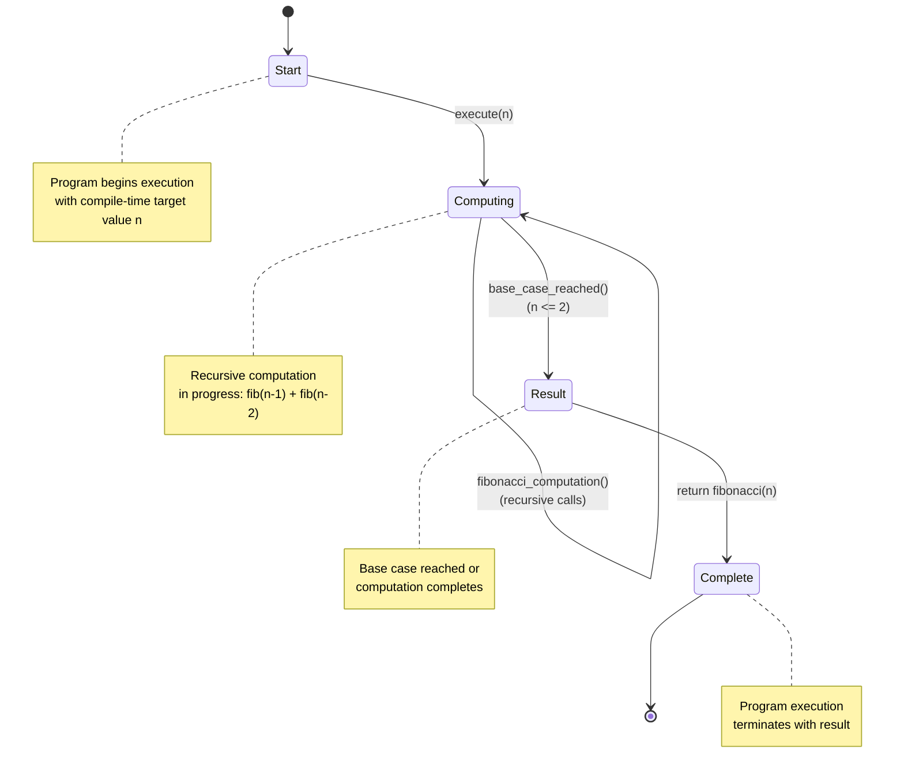

# Fibonacci Algorithm - State Machine View

This view represents the execution lifecycle of the Fibonacci algorithm as a state machine diagram. The diagram shows the general computational flow independent of the specific input value.

## State Diagram



## State Descriptions

| State | Description |
| --- | --- |
| **Start** | Program begins execution with a compile-time target value `n` |
| **Computing** | Recursive computation is in progress, evaluating `fib(n-1) + fib(n-2)` |
| **Result** | Computation completes when base case is reached or final result is computed |
| **Complete** | Program execution terminates successfully with `fibonacci(n)` |

## State Transitions

| From State | Event | Condition | To State |
| --- | --- | --- | --- |
| Start | `execute(n)` | Program starts with target value `n` | Computing |
| Computing | `fibonacci_computation()` | Recursive computation proceeds | Computing (until base case) |
| Computing | `base_case_reached()` | n <= 2 in recursion | Result |
| Result | - | Final result computed | Complete |

## Algorithmic Flow

1. **Initialization**: Program starts with a target value `n` compiled into the script
2. **Recursive Descent**: Algorithm recursively computes `fib(n-1)` and `fib(n-2)`
3. **Base Case Handling**: When `n <= 2`, return 1 (Fibonacci base cases)
4. **Result Assembly**: Combine recursive results to produce `fibonacci(n)`
5. **Termination**: Return the final computed value

## Notes

- This represents the **general Fibonacci algorithm**, not a specific test case
- The state machine is **input-agnostic** - works for any valid integer `n`
- There are **no failure states** for valid inputs since Fibonacci is mathematically well-defined
- The Computing state represents the recursive call stack unwinding process
- For the benchmark scenario, `n=25` is used as the specific test case

## Diagram Source

The state machine diagram is embedded directly in this markdown file using GitHub's native Mermaid rendering. The diagram source is also available as a separate file: [`fibonacci-state-machine.mmd`](fibonacci-state-machine.mmd).

For local development or alternative renderers, you can generate a PNG using:

```bash
mmdc -i scenarios/fibonacci-state-machine.mmd -o scenarios/fibonacci-state-machine.png
```
