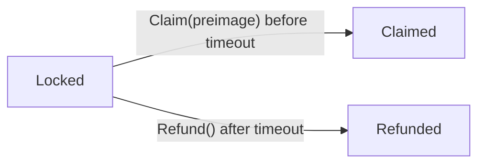
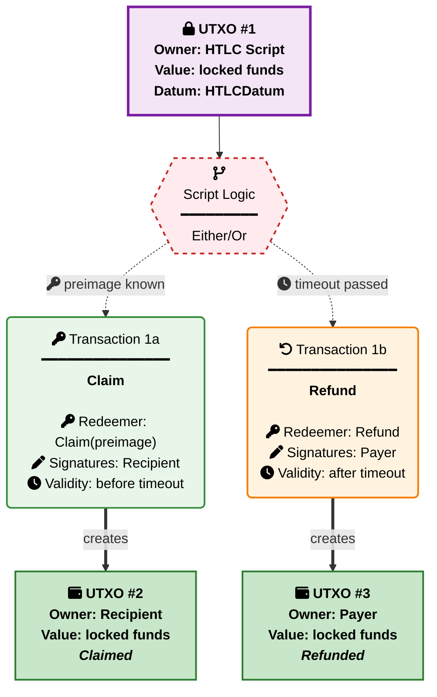

# HTLC (Hashed Time-Locked Contract) Benchmark Scenario

## Overview

The HTLC benchmark is a **real-world smart contract scenario** designed to measure the performance characteristics of validator implementations as UPLC programs. This benchmark tests a compiler's ability to optimize cryptographic hash verification (SHA-256), temporal checks, authorization via transaction signatures, and constructor-tagged datum/redeemer traversal in a practical hashed time-locked payment contract.

## TL;DR

Implement a hashed time-locked contract validator that handles claim-with-preimage and refund-after-timeout operations, and compile it as a fully-applied UPLC program.

**Required Files**: Submit `htlc.uplc`, `metadata.json`, `metrics.json` to `submissions/htlc/{Compiler}_{Version}_{Handle}/`

**Target**: Both Claim and Refund sequences. Expected result: `() (unit)` **Metrics**: CPU units, Memory units, Script size (bytes), Term size **Constraints**: Plutus Core 1.1.0, Plutus V3 recommended, CEK machine budget limits **Implementation**: Handle claim with preimage verification and refund with timeout enforcement

## Exact Task

Implement an HTLC validator and compile it as a **fully-applied UPLC program** that locks funds until either the recipient reveals a preimage of a known hash (claim) or the payer reclaims them after a deadline passes (refund).

### Core Requirements

1. **Validator Implementation**: Create a validator with signature `BuiltinData -> BuiltinUnit` that handles two redeemer types:
   - `Claim preimage` (redeemer = 0(preimage)): Recipient withdraws funds by revealing a preimage whose SHA-256 digest matches the datum hash, before the timeout
   - `Refund` (redeemer = 1()): Payer reclaims funds after the timeout has passed

2. **Fixed Parameters**: The following parameters must be carried on-chain via the inline datum:
   - **Payer PubKeyHash**: `bbbbbbbbbbbbbbbbbbbbbbbbbbbbbbbbbbbbbbbbbbbbbbbbbbbbbbbbbbbbbbbb`
   - **Recipient PubKeyHash**: `aaaaaaaaaaaaaaaaaaaaaaaaaaaaaaaaaaaaaaaaaaaaaaaaaaaaaaaaaaaaaaaa`
   - **Secret Hash** (SHA-256 of preimage `#deadbeef`): `5f78c33274e43fa9de5659265c1d917e25c03722dcb0b8d27db8d5feaa813953`
   - **Timeout**: 100 (POSIX timestamp)

3. **State Transitions**: The validator must enforce preimage matching, signature authorization, and temporal rules

### Datum Encoding

The `HTLCDatum` is a constructor with tag 0 and 4 fields:

```text
HTLCDatum = 0(
  payer,      -- Address (containing PubKeyHash)
  recipient,  -- Address (containing PubKeyHash)
  hash,       -- ByteString (SHA-256 digest, 32 bytes)
  timeout     -- Integer (POSIX timestamp)
)
```

### Redeemer Encoding

```text
Claim preimage = 0(preimage)  -- Recipient reveals preimage and claims
Refund         = 1()           -- Payer reclaims after timeout
```

**Important**: Redeemers are encoded as Plutus Data constructors, not raw integers. A raw integer `1` is distinct from constructor `1()` and must be rejected by the validator. The `Claim` constructor carries a single `ByteString` field — the preimage.

### Test Context Assumptions

When testing this validator, the test framework uses generic dummy constants for script context setup:

**Script Input (UTXO Being Spent):**

- **Script Hash**: `1111111111111111111111111111111111111111111111111111111111` (generic test identifier)
- **Transaction ID**: `3333333333333333333333333333333333333333333333333333333333333333`
- **Output Index**: `0`

**Transaction Context:**

- The validator is spending from a script address with the above dummy script hash
- No continuing output is required: both claim and refund fully consume the script UTXO
- Claim validation requires recipient signature, a preimage whose SHA-256 digest matches the datum hash, and the upper bound of the valid range to be finite and strictly less than the timeout
- Refund validation requires payer signature and the lower bound of the valid range to be finite and strictly greater than the timeout

**Test Framework Behavior:**

- The baseline ScriptContext starts minimal with empty inputs and outputs lists
- Test patches add specific transaction inputs, signatures, and valid-time ranges as needed for each test case
- All script contexts use the above dummy transaction reference for spending operations

## View 1: State Lifecycle View

The HTLC validator operates as a **terminal-state validator**: the locked UTXO is spent exactly once via one of two mutually exclusive paths.



| Current State | Event | Condition | Next State |
| --- | --- | --- | --- |
| **Locked** | `Claim(preimage)` | `sha2_256(preimage) == hash`, recipient sig, `upperBound(validRange) < timeout` | **Claimed** |
| **Locked** | `Refund()` | Payer sig, `lowerBound(validRange) > timeout` | **Refunded** |
| **Claimed** | - | Funds delivered to recipient | **Final** |
| **Refunded** | - | Funds returned to payer | **Final** |

**State Descriptions**:

- **Locked**: Funds are locked at the script address with the HTLC datum.
- **Claimed**: Recipient has revealed the preimage before the timeout and withdrawn the funds.
- **Refunded**: Payer has reclaimed the funds after the timeout expired without a successful claim.
- **Final**: Terminal state, no UTXO remains at the script address.

**Note**: The two paths are mutually exclusive at the validator level via the temporal check: claim requires the **upper bound** of the transaction's valid range to be finite and strictly less than `timeout`, while refund requires the **lower bound** to be finite and strictly greater than `timeout`. Both comparisons are strict.

## View 2: Transaction Sequence View

### UTXO Flow Diagram



### Performance Measurement Sequences (Happy Paths)

Both **Claim** and **Refund** sequences are measured for comprehensive performance benchmarking:

**Complete Transaction Flow**:

1. **Locked -> Claimed**: Recipient reveals preimage before timeout (Claim path)
2. **Locked -> Refunded**: Payer reclaims after timeout (Refund path)

**Performance Measurement**: Sum of CPU/Memory units across all unique operations (Claim + Refund)

**Extended Negative Test Sequences**:

- Authorization violations (missing or wrong signatures)
- Temporal violations (claim after timeout, refund before timeout)
- Preimage violations (wrong preimage, empty preimage, wrong length)
- Double satisfaction violations (multiple script inputs)
- Invalid redeemer format violations

## Implementation Requirements

### Technical Constraints

1. **Execution Budget**: Each transaction step must complete within CEK machine limits
2. **Determinism**: Results must be identical across multiple executions
3. **Self-Contained**: All parameters carried via inline datum
4. **Correctness**: Must enforce all validation rules correctly
5. **Signature**: Validator function type `BuiltinData -> BuiltinUnit`

### Validation Rules

#### Claim Operation (Redeemer = 0(preimage))

- **Authorization**: Transaction signed by recipient's PubKeyHash
- **Preimage Check**: `sha2_256(preimage) == hash` (the datum's stored digest)
- **Time Check**: Upper bound of valid range must be finite and strictly less than `timeout`
- **Single Script Input**: Exactly one input from this script address (prevents double satisfaction)

#### Refund Operation (Redeemer = 1())

- **Authorization**: Transaction signed by payer's PubKeyHash
- **Time Check**: Lower bound of valid range must be finite and strictly greater than `timeout`
- **Single Script Input**: Exactly one input from this script address (prevents double satisfaction)

**Note on time semantics**: For the claim path the validator reads the **upper bound** of `txInfoValidRange`; it must be finite (an infinite upper bound is rejected) and must satisfy `upperBound < timeout` (strict). For the refund path the validator reads the **lower bound**; it must be finite (an infinite lower bound is rejected) and must satisfy `lowerBound > timeout` (strict). For a finite inclusive upper bound `t`, `upperBound = t`; for a finite exclusive upper bound `t`, `upperBound = t − 1`. Symmetrically for the lower bound: inclusive `t` ⇒ `lowerBound = t`; exclusive `t` ⇒ `lowerBound = t + 1`. This is the production-safe convention — using the upper bound for the "before deadline" check guarantees the real block time cannot exceed the deadline even when the transaction specifies an unusually wide validity range. Linear Vesting and Two-Party Escrow currently use a different convention; unification is tracked in a follow-up issue.

## Test Constants and Fixed Values

The HTLC tests rely on a consistent set of fixed constants to ensure reproducible and predictable test scenarios.

### Core HTLC Parameters

**Preimage and Hash:**

- **Preimage (correct)**: `#deadbeef` (4 bytes)
- **Preimage (wrong)**: `#cafebabe` (4 bytes) — used to test hash mismatch
- **Preimage (empty)**: `#` (0 bytes) — used to test hash mismatch
- **Hash** (SHA-256 of the correct preimage): `#5f78c33274e43fa9de5659265c1d917e25c03722dcb0b8d27db8d5feaa813953` (32 bytes)

**Timing:**

- **Timeout**: 100 (POSIX timestamp)

### Address Constants

**Public Key Hashes:**

- **Payer PubKeyHash**: `bbbbbbbbbbbbbbbbbbbbbbbbbbbbbbbbbbbbbbbbbbbbbbbbbbbbbbbbbbbbbbbb` (32 bytes)
- **Recipient PubKeyHash**: `aaaaaaaaaaaaaaaaaaaaaaaaaaaaaaaaaaaaaaaaaaaaaaaaaaaaaaaaaaaaaaaa` (32 bytes)
- **Impostor PubKeyHash**: `cccccccccccccccccccccccccccccccccccccccccccccccccccccccccccccccc` (32 bytes) — used in wrong-signature test scenarios

**Script Hash:**

- **Test Script Hash**: `1111111111111111111111111111111111111111111111111111111111` (28 bytes)

### Transaction References

**UTXO References:**

- **Primary TxId**: `3333333333333333333333333333333333333333333333333333333333333333` (32 bytes) — used for the script input being spent in test scenarios
- **Secondary TxId**: `4444444444444444444444444444444444444444444444444444444444444444` (32 bytes) — used for double-satisfaction tests (second script input)

### Redeemer Values

**Operation Codes:**

- **Claim**: `0(<preimage>)` (constructor 0 with a single ByteString field) — recipient reveals preimage
- **Refund**: `1()` (constructor 1, no fields) — payer reclaims after timeout

### Test-Specific Values

**Temporal Boundaries:**

Claim fixtures use a point interval `[t, t]` so the upper bound equals `t`; refund fixtures use `[t, +∞)` so the lower bound equals `t`.

- **Well Before Timeout**: time=50 — Valid for claim (upperBound=50 < 100)
- **Just Before Timeout**: time=99 — Valid for claim (upperBound=99 < 100)
- **At Timeout**: time=100 — Should fail for both claim and refund (strict comparisons)
- **Just After Timeout**: time=101 — Valid for refund (lowerBound=101 > 100)
- **Well After Timeout**: time=200 — Valid for refund (lowerBound=200 > 100)

## Test Cases

The HTLC validator is tested through a comprehensive suite of test cases covering all operations, edge cases, and failure scenarios.

### Invalid Redeemer Tests

- **`redeemer_integer_0`** Tests that validator fails when redeemer is raw integer 0 instead of constructor 0(preimage)

- **`redeemer_integer_1`** Tests that validator fails when redeemer is raw integer 1 instead of constructor 1()

- **`redeemer_bytestring`** Tests that validator fails when redeemer is a bytestring instead of a constructor

- **`redeemer_list`** Tests that validator fails when redeemer is a list instead of a constructor

- **`redeemer_claim_without_preimage`** Tests that validator fails when Claim constructor is applied with no fields instead of one ByteString field

### Claim Happy Path Tests

- **`claim_well_before_timeout`** Verifies successful claim at time=50 with correct preimage and recipient signature.

- **`claim_just_before_timeout`** Verifies successful claim at time=99 (one unit before timeout=100). Tests the boundary of the strict "before timeout" check.

### Refund Happy Path Tests

- **`refund_just_after_timeout`** Verifies successful refund at time=101 (one unit after timeout=100). Tests the boundary of the strict "after timeout" check.

- **`refund_well_after_timeout`** Verifies successful refund at time=200 with payer signature.

### Claim Authorization Failure Tests

- **`claim_missing_signature`** Verifies claim fails when recipient signature is missing. All other conditions valid (time=50, correct preimage).

- **`claim_wrong_signature_payer`** Verifies claim fails when only the payer is a signatory (payer cannot claim with the preimage).

- **`claim_wrong_signature_impostor`** Verifies claim fails when only the impostor is a signatory instead of the recipient.

### Claim Preimage Failure Tests

- **`claim_wrong_preimage`** Verifies claim fails when preimage `#cafebabe` is presented — its SHA-256 digest does not match the stored hash.

- **`claim_empty_preimage`** Verifies claim fails when preimage is the empty bytestring — its SHA-256 digest does not match the stored hash.

### Claim Temporal Failure Tests

- **`claim_at_timeout`** Verifies claim fails at time=100, exactly at the timeout boundary. The check is strictly less than, so equal is not sufficient.

- **`claim_after_timeout`** Verifies claim fails at time=150 (after timeout), even with correct preimage and recipient signature.

- **`claim_infinite_upper_bound`** Verifies claim fails when the validity range has no upper bound (`[50, +∞)`). The validator rejects an infinite upper bound.

### Claim Double Satisfaction Test

- **`claim_double_satisfaction`** Verifies claim fails when there are two inputs from the script address. The single-script-input check prevents double satisfaction attacks.

### Refund Authorization Failure Tests

- **`refund_missing_signature`** Verifies refund fails when payer signature is missing. Time is valid (101).

- **`refund_wrong_signature_recipient`** Verifies refund fails when only the recipient is a signatory (recipient cannot refund — only the payer can).

- **`refund_wrong_signature_impostor`** Verifies refund fails when only the impostor is a signatory instead of the payer.

### Refund Temporal Failure Tests

- **`refund_before_timeout`** Verifies refund fails at time=50, before the timeout. The payer must wait until after the deadline.

- **`refund_at_timeout`** Verifies refund fails at time=100, exactly at the timeout boundary. The check is strictly greater than, so equal is not sufficient.

- **`refund_infinite_lower_bound`** Verifies refund fails when the validity range has no lower bound (`(−∞, 200]`). The validator rejects an infinite lower bound.

### Refund Double Satisfaction Test

- **`refund_double_satisfaction`** Verifies refund fails when there are two inputs from the script address.

### Primary Test Cases for Performance Measurement

The core performance measurement focuses on the successful operation sequences:

- **Claim Sequence**: `claim_well_before_timeout` (time=50, preimage=#deadbeef)
- **Refund Sequence**: `refund_well_after_timeout` (time=200)

These test cases provide the baseline performance metrics for measuring CPU units, memory units, script size, and execution efficiency across different validator implementations.

## Measurement Guidelines

### Required Metrics

All submissions must include measurements for **both Claim and Refund operations**:

1. **CPU Units**: Total computational cost (sum of all unique operations: Claim + Refund)
2. **Memory Units**: Peak memory consumption across all operations
3. **Script Size**: Size of the compiled UPLC validator script in bytes
4. **Term Size**: Size of the UPLC term representation

### Measurement Method

**Complete Happy Paths Measurement**:

1. Execute Claim operation (redeemer = `0(#deadbeef)`), record CPU/Memory
2. Execute Refund operation (redeemer = `1()`), record CPU/Memory

**Total Performance**: Sum both unique operations

### Reporting Format

Use the standard metrics schema as defined in `submissions/TEMPLATE/metrics.schema.json`:

```json
{
  "scenario": "htlc",
  "version": "1.0.0",
  "measurements": {
    "cpu_units": {
      "maximum": 0,
      "sum": 0,
      "minimum": 0,
      "median": 0,
      "sum_positive": 0,
      "sum_negative": 0
    },
    "memory_units": {
      "maximum": 0,
      "sum": 0,
      "minimum": 0,
      "median": 0,
      "sum_positive": 0,
      "sum_negative": 0
    },
    "script_size_bytes": 0,
    "term_size": 0
  },
  "evaluations": [
    {
      "name": "claim_well_before_timeout",
      "description": "Claim at time=50 with correct preimage and recipient signature should succeed",
      "cpu_units": 0,
      "memory_units": 0,
      "execution_result": "success"
    },
    {
      "name": "refund_well_after_timeout",
      "description": "Refund at time=200 with payer signature should succeed",
      "cpu_units": 0,
      "memory_units": 0,
      "execution_result": "success"
    }
  ],
  "execution_environment": {
    "evaluator": "PlutusTx.Eval-1.52.0.0"
  },
  "timestamp": "2026-04-22T00:00:00Z",
  "notes": "Measured all happy paths: Claim + Refund operations plus comprehensive negative test cases"
}
```
