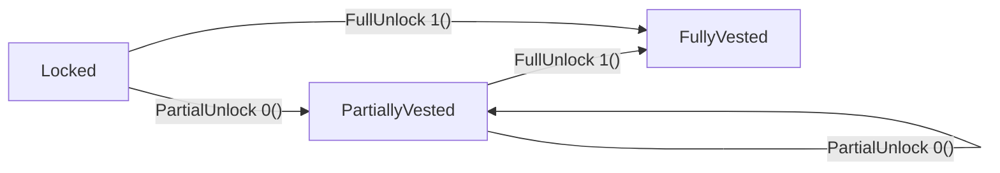
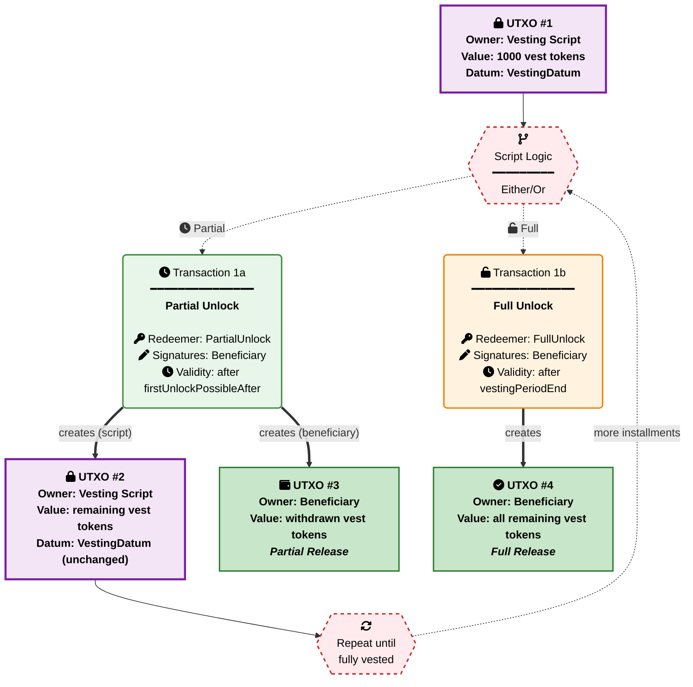

# Linear Vesting Benchmark Scenario

## Overview

The Linear Vesting benchmark is a **real-world smart contract scenario** designed to measure the performance characteristics of validator implementations as UPLC programs. This benchmark tests a compiler's ability to optimize time-based arithmetic, datum preservation checks, ceiling division computations, and multi-field data structure traversal in a practical token vesting contract.

## TL;DR

Implement a linear vesting validator that handles partial and full unlock operations and compile it as a fully-applied UPLC program.

**Required Files**: Submit `linear_vesting.uplc`, `metadata.json`, `metrics.json` to `submissions/linear_vesting/{Compiler}_{Version}_{Handle}/`

**Target**: Both PartialUnlock and FullUnlock sequences. Expected result: `() (unit)`
**Metrics**: CPU units, Memory units, Script size (bytes), Term size
**Constraints**: Plutus Core 1.1.0, Plutus V3 recommended, CEK machine budget limits
**Implementation**: Handle partial unlock with schedule enforcement and full unlock with deadline enforcement

## Exact Task

Implement a linear vesting validator and compile it as a **fully-applied UPLC program** that controls the gradual release of tokens over a predefined time schedule.

### Core Requirements

1. **Validator Implementation**: Create a validator with signature `BuiltinData -> BuiltinUnit` that handles two redeemer types:
   - `PartialUnlock` (redeemer = 0()): Allow beneficiary to withdraw tokens proportionally as time passes
   - `FullUnlock` (redeemer = 1()): Allow beneficiary to withdraw everything after the vesting period ends

2. **Fixed Parameters**: The following parameters must be baked into the UPLC program via the datum:
   - **Beneficiary PubKeyHash**: `aaaaaaaaaaaaaaaaaaaaaaaaaaaaaaaaaaaaaaaaaaaaaaaaaaaaaaaaaaaaaaaa`
   - **Vesting Asset**: CurrencySymbol `dddddddddddddddddddddddddddddddddddddddddddddddddddddddd`, TokenName `76657374` ("vest")
   - **Total Vesting Quantity**: 1000 tokens
   - **Vesting Period Start**: 0 (POSIX timestamp)
   - **Vesting Period End**: 100 (POSIX timestamp)
   - **First Unlock Possible After**: 10 (POSIX timestamp)
   - **Total Installments**: 10

3. **State Transitions**: The validator must enforce proper vesting schedule, datum preservation, and authorization rules

### Datum Encoding

The `VestingDatum` is a constructor with tag 0 and 7 fields:

```text
VestingDatum = 0(
  beneficiary,              -- Address (containing PubKeyHash)
  vestingAsset,             -- AssetClass: 0(CurrencySymbol, TokenName)
  totalVestingQty,          -- Integer
  vestingPeriodStart,       -- Integer (POSIX timestamp)
  vestingPeriodEnd,         -- Integer (POSIX timestamp)
  firstUnlockPossibleAfter, -- Integer (POSIX timestamp)
  totalInstallments         -- Integer
)
```

### Redeemer Encoding

```text
PartialUnlock = 0()  -- Beneficiary withdraws proportional tokens
FullUnlock    = 1()  -- Beneficiary withdraws all remaining tokens
```

**Important**: Redeemers are encoded as Plutus Data constructors, not raw integers. A raw integer `0` is distinct from constructor `0()` and must be rejected by the validator.

### Test Context Assumptions

When testing this validator, the test framework uses generic dummy constants for script context setup:

**Script Input (UTXO Being Spent):**

- **Script Hash**: `1111111111111111111111111111111111111111111111111111111111` (generic test identifier)
- **Transaction ID**: `3333333333333333333333333333333333333333333333333333333333333333`
- **Output Index**: `0`

**Transaction Context:**

- The validator is spending from a script address with the above dummy script hash
- Transaction outputs to the same script address represent continuing vesting UTXOs
- PartialUnlock validation requires checking that the correct remaining token quantity is sent back to the script address with an identical datum
- FullUnlock validation only requires beneficiary signature and temporal check

**Test Framework Behavior:**

- The baseline ScriptContext starts minimal with empty inputs and outputs lists
- Test patches add specific transaction inputs/outputs as needed for each test case
- PartialUnlock tests use patches to add outputs with the expected remaining tokens at the script address
- All script contexts use the above dummy transaction reference for spending operations

## View 1: State Lifecycle View

The Linear Vesting validator operates as a **state machine validator** with a looping partial unlock:



| Current State | Event | Condition | Next State |
| --- | --- | --- | --- |
| **Locked** | `PartialUnlock(0())` | After first unlock time, schedule-correct withdrawal | **PartiallyVested** |
| **PartiallyVested** | `PartialUnlock(0())` | Continued schedule-correct withdrawal, datum preserved | **PartiallyVested** |
| **PartiallyVested** | `FullUnlock(1())` | After vesting period end, beneficiary sig | **FullyVested** |
| **Locked** | `FullUnlock(1())` | After vesting period end, beneficiary sig | **FullyVested** |
| **FullyVested** | - | All tokens released | **Final** |

**State Descriptions**:

- **Locked**: Tokens are locked at the script address with vesting datum. No withdrawals have occurred yet.
- **PartiallyVested**: Some tokens have been withdrawn according to the vesting schedule. Remaining tokens stay at the script address with the original datum intact.
- **FullyVested**: All tokens have been released to the beneficiary. Terminal state, no further transactions.
- **Final**: Terminal state, no UTXO remains at the script address.

**Note**: Each state transition must validate appropriate signatures, timing constraints, and (for partial unlock) correct remaining quantity per the vesting schedule.

## View 2: Transaction Sequence View

### UTXO Flow Diagram



### Performance Measurement Sequences (Happy Paths)

Both **PartialUnlock** and **FullUnlock** sequences are measured for comprehensive performance benchmarking:

**Complete Transaction Flow**:

1. **Locked -> PartiallyVested**: Beneficiary withdraws proportional tokens (PartialUnlock path)
2. **Locked/PartiallyVested -> FullyVested**: Beneficiary withdraws everything after vesting period (FullUnlock path)

**Performance Measurement**: Sum of CPU/Memory units across all unique operations (PartialUnlock + FullUnlock)

**Extended Negative Test Sequences**:

- Authorization violations (missing or wrong signatures)
- Temporal violations (unlock before allowed time)
- Amount violations (incorrect remaining quantities)
- Datum violations (modified or missing datum on continuing output)
- Double satisfaction violations (multiple script inputs)
- Invalid redeemer format violations

## Implementation Requirements

### Technical Constraints

1. **Execution Budget**: Each transaction step must complete within CEK machine limits
2. **Determinism**: Results must be identical across multiple executions
3. **Self-Contained**: All parameters baked into UPLC program via datum
4. **Correctness**: Must enforce all validation rules correctly
5. **Signature**: Validator function type `BuiltinData -> BuiltinUnit`

### Validation Rules

#### PartialUnlock Operation (Redeemer = 0())

- **Authorization**: Transaction signed by beneficiary's PubKeyHash
- **Time Check**: Current time (lower bound of valid range) must be strictly greater than `firstUnlockPossibleAfter`
- **Non-Zero Remaining**: New remaining asset quantity at script address must be > 0
- **Monotonic Decrease**: New remaining must be strictly less than old remaining
- **Correct Vesting Schedule**: New remaining must equal `expectedRemainingQty` calculated as:
  - `vestingPeriodLength = vestingPeriodEnd - vestingPeriodStart`
  - `vestingTimeRemaining = vestingPeriodEnd - currentTime`
  - `timeBetweenTwoInstallments = divCeil(vestingPeriodLength, totalInstallments)`
  - `futureInstallments = divCeil(vestingTimeRemaining, timeBetweenTwoInstallments)`
  - `expectedRemainingQty = divCeil(futureInstallments * totalVestingQty, totalInstallments)`
  - where `divCeil(x, y) = 1 + ((x - 1) / y)` (integer ceiling division)
- **Datum Preservation**: Output datum at script address must be identical to input datum
- **Single Script Input**: Exactly one input from this script address (prevents double satisfaction)

#### FullUnlock Operation (Redeemer = 1())

- **Authorization**: Transaction signed by beneficiary's PubKeyHash
- **Time Check**: Current time (lower bound of valid range) must be strictly greater than `vestingPeriodEnd`

### Vesting Schedule Reference

With the test constants (vestingPeriodStart=0, vestingPeriodEnd=100, totalInstallments=10, totalVestingQty=1000):

| Time | vestingTimeRemaining | timeBetweenInstallments | futureInstallments | expectedRemaining |
|------|---------------------|------------------------|--------------------|-------------------|
| 11   | 89                  | 10                     | 9                  | 900               |
| 20   | 80                  | 10                     | 8                  | 800               |
| 25   | 75                  | 10                     | 8                  | 800               |
| 50   | 50                  | 10                     | 5                  | 500               |
| 91   | 9                   | 10                     | 1                  | 100               |
| 99   | 1                   | 10                     | 1                  | 100               |
| 100  | 0                   | 10                     | 0                  | 0 (FullUnlock)    |

**Calculation Walkthrough (time=25)**:
- `vestingPeriodLength = 100 - 0 = 100`
- `vestingTimeRemaining = 100 - 25 = 75`
- `timeBetweenTwoInstallments = divCeil(100, 10) = 10`
- `futureInstallments = divCeil(75, 10) = 1 + ((75 - 1) / 10) = 1 + 7 = 8`
- `expectedRemainingQty = divCeil(8 * 1000, 10) = divCeil(8000, 10) = 800`

Note that time=25 falls between installment boundaries (20 and 30), so the remaining quantity is the same as at time=20. The ceiling division ensures tokens are released only at installment boundaries, never ahead of schedule.

## Test Constants and Fixed Values

The linear vesting tests rely on a consistent set of fixed constants to ensure reproducible and predictable test scenarios.

### Core Vesting Parameters

**Asset:**

- **Currency Symbol**: `dddddddddddddddddddddddddddddddddddddddddddddddddddddddd` (28 bytes)
- **Token Name**: `76657374` (hex for "vest")
- **Total Vesting Quantity**: 1000 tokens

**Timing:**

- **Vesting Period Start**: 0 (POSIX timestamp)
- **Vesting Period End**: 100 (POSIX timestamp)
- **First Unlock Possible After**: 10 (POSIX timestamp)
- **Total Installments**: 10
- **Time Between Installments**: 10 (calculated: divCeil(100, 10))

### Address Constants

**Public Key Hashes:**

- **Beneficiary PubKeyHash**: `aaaaaaaaaaaaaaaaaaaaaaaaaaaaaaaaaaaaaaaaaaaaaaaaaaaaaaaaaaaaaaaa` (32 bytes)
  - Used for beneficiary signature validation and token release destination
- **Impostor PubKeyHash**: `cccccccccccccccccccccccccccccccccccccccccccccccccccccccccccccccc` (32 bytes)
  - Used in wrong-signature test scenarios

**Script Hash:**

- **Test Script Hash**: `1111111111111111111111111111111111111111111111111111111111` (28 bytes)
  - Standard script address used across all vesting operations

### Transaction References

**UTXO References:**

- **Primary TxId**: `3333333333333333333333333333333333333333333333333333333333333333` (32 bytes)
  - Used for the script input being spent in test scenarios
- **Secondary TxId**: `4444444444444444444444444444444444444444444444444444444444444444` (32 bytes)
  - Used for double-satisfaction tests (second script input)

### Redeemer Values

**Operation Codes:**

- **PartialUnlock**: `0()` (constructor 0, no fields) - Beneficiary withdraws proportional tokens
- **FullUnlock**: `1()` (constructor 1, no fields) - Beneficiary withdraws all remaining tokens

### Test-Specific Values

**Temporal Boundaries:**

- **Before First Unlock**: time=5 - Should fail for partial unlock (must be strictly after 10)
- **At First Unlock**: time=10 - Should fail for partial unlock (must be strictly after, not equal)
- **After First Unlock**: time=11+ - Valid for partial unlock
- **Before Period End**: time=50 - Should fail for full unlock
- **At Period End**: time=100 - Should fail for full unlock (must be strictly after)
- **After Period End**: time=101+ - Valid for full unlock

These constants ensure that all tests operate with predictable, well-defined scenarios that thoroughly validate the vesting validator's behavior across different conditions and edge cases.

## Test Cases

The linear vesting validator is tested through a comprehensive suite of test cases covering all operations, edge cases, and failure scenarios. Each test case validates specific aspects of the validator logic.

### Invalid Redeemer Tests

- **`redeemer_integer_0`**
  Tests that validator fails when redeemer is raw integer 0 instead of constructor 0()

- **`redeemer_integer_1`**
  Tests that validator fails when redeemer is raw integer 1 instead of constructor 1()

- **`redeemer_integer_99`**
  Tests that validator fails when redeemer is an arbitrary integer

- **`redeemer_bytestring`**
  Tests that validator fails when redeemer is a bytestring instead of a constructor

- **`redeemer_list`**
  Tests that validator fails when redeemer is a list instead of a constructor

### PartialUnlock Happy Path Tests

- **`partial_unlock_first_installment`**
  Verifies successful partial unlock at time=11, remaining goes from 1000 to 900 tokens. Beneficiary signature present, datum preserved, single script input.

- **`partial_unlock_mid_vesting`**
  Verifies successful partial unlock at time=50, remaining goes from 1000 to 500 tokens. Tests mid-schedule withdrawal with correct remaining calculation.

- **`partial_unlock_near_end`**
  Verifies successful partial unlock at time=91, remaining goes from 1000 to 100 tokens. Tests near-end withdrawal where only one future installment remains.

- **`partial_unlock_between_installments`**
  Verifies successful partial unlock at time=25, remaining goes from 1000 to 800 tokens. Tests that withdrawal between installment boundaries uses ceiling division correctly (same result as time=20).

### FullUnlock Happy Path Tests

- **`full_unlock_after_period_end`**
  Verifies successful full unlock at time=101. Beneficiary signature present, all tokens released.

- **`full_unlock_well_after`**
  Verifies successful full unlock at time=200. Tests that unlock works well beyond the vesting period end.

### PartialUnlock Authorization Failure Tests

- **`partial_unlock_missing_signature`**
  Verifies partial unlock fails when beneficiary signature is missing from the transaction. All other conditions valid (time=11, correct remaining=900).

- **`partial_unlock_wrong_signature`**
  Verifies partial unlock fails when impostor signature is present instead of beneficiary. All other conditions valid.

- **`partial_unlock_no_signatures`**
  Verifies partial unlock fails when the signatories list is empty. All other conditions valid.

### PartialUnlock Temporal Failure Tests

- **`partial_unlock_before_first_unlock`**
  Verifies partial unlock fails when time=5, which is before the firstUnlockPossibleAfter threshold of 10.

- **`partial_unlock_at_first_unlock`**
  Verifies partial unlock fails when time=10, exactly at the firstUnlockPossibleAfter boundary. The check is strictly greater than, so equal is not sufficient.

### PartialUnlock Amount Failure Tests

- **`partial_unlock_zero_remaining`**
  Verifies partial unlock fails when new remaining quantity is 0. The non-zero check requires remaining > 0 for partial unlock (full unlock should be used when all tokens are released).

- **`partial_unlock_not_decreasing`**
  Verifies partial unlock fails when new remaining quantity is greater than or equal to the old remaining. The monotonic decrease check prevents no-op or inflationary transactions.

- **`partial_unlock_wrong_remaining_too_low`**
  Verifies partial unlock fails when remaining quantity is lower than what the vesting schedule dictates. For example, at time=11 the expected remaining is 900 but the output contains 800.

- **`partial_unlock_wrong_remaining_too_high`**
  Verifies partial unlock fails when remaining quantity is higher than what the vesting schedule dictates. For example, at time=11 the expected remaining is 900 but the output contains 950.

### PartialUnlock Datum Failure Tests

- **`partial_unlock_datum_modified`**
  Verifies partial unlock fails when the output datum at the script address differs from the input datum. Datum preservation is required to maintain vesting parameters across partial withdrawals.

- **`partial_unlock_datum_missing`**
  Verifies partial unlock fails when the continuing output at the script address has no datum attached. The validator requires datum continuity.

### PartialUnlock Double Satisfaction Test

- **`partial_unlock_double_satisfaction`**
  Verifies partial unlock fails when there are two inputs from the script address. The single-script-input check prevents double satisfaction attacks where an attacker pairs their own script input with the vesting input.

### FullUnlock Authorization Failure Tests

- **`full_unlock_missing_signature`**
  Verifies full unlock fails when beneficiary signature is missing from the transaction. Time is valid (101), but no signature present.

- **`full_unlock_wrong_signature`**
  Verifies full unlock fails when impostor signature is present instead of beneficiary. Time is valid (101).

### FullUnlock Temporal Failure Tests

- **`full_unlock_before_period_end`**
  Verifies full unlock fails when time=50, which is before the vestingPeriodEnd of 100. The beneficiary must use partial unlock during the vesting period.

- **`full_unlock_at_period_end`**
  Verifies full unlock fails when time=100, exactly at the vestingPeriodEnd boundary. The check is strictly greater than, so equal is not sufficient.

### Primary Test Cases for Performance Measurement

The core performance measurement focuses on the successful operation sequences:

- **PartialUnlock Sequence**: `partial_unlock_first_installment` (time=11, 1000 -> 900)
- **FullUnlock Sequence**: `full_unlock_after_period_end` (time=101, all tokens released)

These test cases provide the baseline performance metrics for measuring CPU units, memory units, script size, and execution efficiency across different validator implementations.

## Measurement Guidelines

### Required Metrics

All submissions must include measurements for **both PartialUnlock and FullUnlock operations**:

1. **CPU Units**: Total computational cost (sum of all unique operations: PartialUnlock + FullUnlock)
2. **Memory Units**: Peak memory consumption across all operations
3. **Script Size**: Size of the compiled UPLC validator script in bytes
4. **Term Size**: Size of the UPLC term representation

### Measurement Method

**Complete Happy Paths Measurement**:

1. Execute PartialUnlock operation (redeemer = 0()), record CPU/Memory
2. Execute FullUnlock operation (redeemer = 1()), record CPU/Memory

**Total Performance**: Sum both unique operations

### Reporting Format

Use the standard metrics schema as defined in `submissions/TEMPLATE/metrics.schema.json`:

```json
{
  "scenario": "linear_vesting",
  "version": "1.0.0",
  "measurements": {
    "cpu_units": {
      "maximum": 0,
      "sum": 0,
      "minimum": 0,
      "median": 0,
      "sum_positive": 0,
      "sum_negative": 0
    },
    "memory_units": {
      "maximum": 0,
      "sum": 0,
      "minimum": 0,
      "median": 0,
      "sum_positive": 0,
      "sum_negative": 0
    },
    "script_size_bytes": 0,
    "term_size": 0
  },
  "evaluations": [
    {
      "name": "partial_unlock_first_installment",
      "description": "Partial unlock at time=11, remaining 1000 to 900 tokens should succeed",
      "cpu_units": 0,
      "memory_units": 0,
      "execution_result": "success"
    },
    {
      "name": "partial_unlock_mid_vesting",
      "description": "Partial unlock at time=50, remaining 1000 to 500 tokens should succeed",
      "cpu_units": 0,
      "memory_units": 0,
      "execution_result": "success"
    },
    {
      "name": "full_unlock_after_period_end",
      "description": "Full unlock at time=101, all tokens released should succeed",
      "cpu_units": 0,
      "memory_units": 0,
      "execution_result": "success"
    }
  ],
  "execution_environment": {
    "evaluator": "PlutusTx.Eval-1.52.0.0"
  },
  "timestamp": "2025-01-15T10:30:00Z",
  "notes": "Measured all happy paths: PartialUnlock + FullUnlock operations plus comprehensive negative test cases"
}
```

**Field Explanations:**

**Measurements Object**: Contains performance metrics across all test evaluations:

- **cpu_units/memory_units objects**: Multiple aggregation strategies for comprehensive analysis:
  - `maximum`: Peak resource usage (worst-case performance)
  - `sum`: Total resources across all evaluations (overall computational work)
  - `minimum`: Best-case resource usage (optimal performance)
  - `median`: Typical resource usage (normal performance)
  - `sum_positive`: Resources from successful evaluations only
  - `sum_negative`: Resources from failed evaluations only

- **script_size_bytes**: Size of the compiled UPLC validator script in bytes
- **term_size**: Number of AST nodes in the UPLC term representation

**Evaluations Array**: Individual test case measurements showing per-evaluation performance data. Each evaluation includes:

- `name`: Test case identifier
- `description`: What the test validates
- `cpu_units/memory_units`: Resources consumed for this specific test
- `execution_result`: "success" for validation pass, "error" for validation failure

**Environment Info**:

- `evaluator`: Tool/version used for UPLC evaluation
- `timestamp`: ISO-8601 timestamp when measurements were taken
- `notes`: Optional implementation details or measurement context
