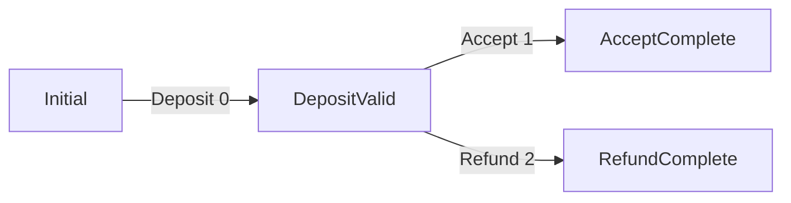
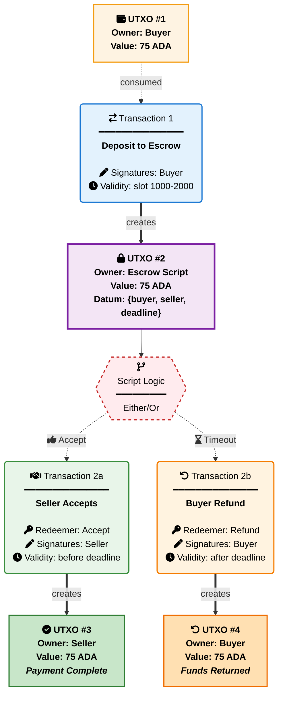

# Two-Party Escrow Benchmark Scenario

## Overview

The Two-Party Escrow benchmark is a **real-world smart contract scenario** designed to measure the performance characteristics of validator implementations as UPLC programs. This benchmark tests a compiler's ability to optimize conditional logic, data structure access, cryptographic operations, and state transitions in a practical escrow contract.

## TL;DR

Implement a two-party escrow validator that handles deposit, accept, and refund operations and compile it as a fully-applied UPLC program.

**Required Files**: Submit `two-party-escrow.uplc`, `metadata.json`, `metrics.json` to `submissions/two-party-escrow/{Compiler}_{Version}_{Handle}/`

**Target**: Both Accept and Refund sequences → Expected result: `() (unit)`  
**Metrics**: CPU units, Memory units, Script size (bytes), Term size  
**Constraints**: Plutus Core 1.1.0, Plutus V3 recommended, CEK machine budget limits  
**Implementation**: Handle deposit, accept, and refund with proper validation

## Exact Task

Implement a two-party escrow validator and compile it as a **fully-applied UPLC program** that processes escrow transactions through deposit, accept, and refund operations.

### Core Requirements

1. **Validator Implementation**: Create a validator with signature `BuiltinData -> BuiltinUnit` that handles three redeemer types:

   - `Deposit` (redeemer = 0): Allow buyer to deposit funds into escrow
   - `Accept` (redeemer = 1): Allow seller to accept and complete the escrow
   - `Refund` (redeemer = 2): Allow buyer to reclaim funds after deadline

2. **Fixed Parameters**: The following parameters must be baked into the UPLC program:

   - **Buyer Address**: `aaaaaaaaaaaaaaaaaaaaaaaaaaaaaaaaaaaaaaaaaaaaaaaaaaaaaaaaaaaaaaaa`
   - **Seller Address**: `bbbbbbbbbbbbbbbbbbbbbbbbbbbbbbbbbbbbbbbbbbbbbbbbbbbbbbbbbbbbbbbb`
   - **Price**: 75 ADA (75,000,000 lovelace)
   - **Deadline**: 30 minutes after deposit (1800 seconds)

3. **State Transitions**: The validator must enforce proper state transitions and validation rules

### Redeemer Encoding

```text
Deposit = 0  -- Buyer deposits 75 ADA into escrow
Accept  = 1  -- Seller accepts and receives payment
Refund  = 2  -- Buyer reclaims funds after deadline
```

### Test Context Assumptions

When testing this validator, the test framework uses generic dummy constants for script context setup:

**Script Input (UTXO Being Spent):**

- **Script Hash**: `1111111111111111111111111111111111111111111111111111111111` (generic test identifier)
- **Transaction ID**: `0000000000000000000000000000000000000000000000000000000000000000`
- **Output Index**: `0`

**Transaction Context:**

- The validator is spending from a script address with the above dummy script hash
- Transaction outputs to the same script address represent continuing escrow UTXOs
- Deposit validation requires checking that exactly 75 ADA is sent to the script address

**Test Framework Behavior:**

- The baseline ScriptContext starts minimal with empty inputs and outputs lists
- Test patches add specific transaction inputs/outputs as needed for each test case
- Deposit validation tests use patches to add outputs with 75 ADA to the script address
- All script contexts use the above dummy transaction reference for spending operations

## View 1: State Lifecycle View

The Two-Party Escrow validator operates as a **state machine validator**:



| Current State | Event | Condition | Next State |
| --- | --- | --- | --- |
| **Initial** | `Deposit(0)` | Buyer deposits 75 ADA | **DepositValid** |
| **DepositValid** | `Accept(1)` | Seller accepts, funds to seller | **AcceptComplete** |
| **DepositValid** | `Refund(2)` | Past deadline, funds to buyer | **RefundComplete** |
| **AcceptComplete** | - | Escrow completed successfully | **Final** |
| **RefundComplete** | - | Escrow refunded | **Final** |

**State Descriptions**:

- **Initial**: No funds deposited, waiting for buyer deposit
- **DepositValid**: Buyer has deposited 75 ADA, awaiting seller acceptance or deadline
- **AcceptComplete**: Seller has accepted payment, escrow complete
- **RefundComplete**: Buyer has reclaimed funds after deadline
- **Final**: Terminal state, no further transactions

**Note**: Each state transition must validate appropriate signatures, values, and timing constraints

## View 2: Transaction Sequence View

### UTXO Flow Diagram



### Performance Measurement Sequences (Happy Paths)

Both **Accept** and **Refund** sequences are measured for comprehensive performance benchmarking:

**Complete Transaction Flow**:

1. **Initial → DepositValid**: Buyer deposits 75 ADA (shared operation)
2. **DepositValid → AcceptComplete**: Seller accepts payment (Accept path)
3. **DepositValid → RefundComplete**: Buyer reclaims funds after deadline (Refund path)

**Performance Measurement**: Sum of CPU/Memory units across all unique operations (Deposit + Accept + Refund)

**Extended Negative Test Sequences**:

- Authorization violations (wrong signatures)
- Temporal violations (refund before deadline)
- Value violations (incorrect amounts)
- State transition violations (invalid sequences)

## Implementation Requirements

### Technical Constraints

1. **Execution Budget**: Each transaction step must complete within CEK machine limits
2. **Determinism**: Results must be identical across multiple executions
3. **Self-Contained**: All parameters (addresses, price, deadline) baked into UPLC program
4. **Correctness**: Must enforce all validation rules correctly
5. **Signature**: Validator function type `BuiltinData -> BuiltinUnit`

### Validation Rules

#### Deposit Operation (Redeemer = 0)

- **Value Check**: Exactly 75 ADA deposited to script address
- **Authorization**: Transaction signed by buyer
- **State Check**: No existing deposit (initial state)

#### Accept Operation (Redeemer = 1)

- **Value Check**: 75 ADA paid to seller address
- **Authorization**: Transaction signed by seller
- **State Check**: Valid deposit exists
- **Timing**: No deadline restriction for acceptance

#### Refund Operation (Redeemer = 2)

- **Value Check**: 75 ADA returned to buyer address
- **Authorization**: Transaction signed by buyer
- **State Check**: Valid deposit exists
- **Timing**: Current time > deposit time + 1800 seconds

## Test Constants and Fixed Values

The two-party escrow tests (both Haskell specs and `cape-tests.json`) rely on a consistent set of fixed constants to ensure reproducible and predictable test scenarios.

### Core Escrow Parameters

**Amount:**

- **Escrow Price**: 75 ADA (75,000,000 lovelace)
  - Used in all deposit, accept, and refund validations

**Timing:**

- **Deadline Duration**: 30 minutes (1800 seconds)
  - Time limit for seller to accept before buyer can refund
- **Test Deposit Time**: 1000 seconds
  - Fixed timestamp used as baseline in all test scenarios
- **Refund Valid Time**: 1801+ seconds
  - Any time after deposit time (1000) + deadline (1800) + 1

### Address Constants

**Public Key Hashes:**

- **Buyer KeyHash**: `aaaaaaaaaaaaaaaaaaaaaaaaaaaaaaaaaaaaaaaaaaaaaaaaaaaaaaaaaaaaaaaa`
  - Used for buyer signature validation and refund destination
- **Seller KeyHash**: `bbbbbbbbbbbbbbbbbbbbbbbbbbbbbbbbbbbbbbbbbbbbbbbbbbbbbbbbbbbbbbbb`
  - Used for seller signature validation and accept payment destination
- **Test KeyHash**: `cccccccccccccccccccccccccccccccccccccccccccccccccccccccccccccccc`
  - Used in wrong address test scenarios

**Script Hash:**

- **Test Script Hash**: `1111111111111111111111111111111111111111111111111111111111`
  - Standard script address used across all escrow operations

### Transaction References

**UTXO References:**

- **Primary TxId**: `3333333333333333333333333333333333333333333333333333333333333333`
  - Used for deposit operations and various test scenarios
- **Secondary TxId**: `4444444444444444444444444444444444444444444444444444444444444444`
  - Used for accept/refund operations (spending escrow UTXOs)
- **Generic TxId**: `0000000000000000000000000000000000000000000000000000000000000000`
  - Used in test framework baseline configurations

### Redeemer Values

**Operation Codes:**

- **Deposit**: `0` (integer) - Buyer deposits funds into escrow
- **Accept**: `1` (integer) - Seller accepts and receives payment
- **Refund**: `2` (integer) - Buyer reclaims funds after deadline

### Test-Specific Values

**Temporal Boundaries:**

- **Before Deadline**: 900 seconds - Should fail for refund operations
- **At Deadline**: 2800 seconds (1000 + 1800) - Should fail (must be strictly after)
- **After Deadline**: 2801+ seconds - Valid for refund operations
- **Extended Times**: 3000, 3600, 5000 seconds - Used in various success scenarios

These constants ensure that all tests operate with predictable, well-defined scenarios that thoroughly validate the escrow validator's behavior across different conditions and edge cases.

## Test Cases

The two-party escrow validator is tested through a comprehensive suite of test cases covering all operations, edge cases, and failure scenarios. Each test case validates specific aspects of the validator logic.

- **`redeemer_integer_3`**  
  Tests that validator fails when redeemer is invalid integer 3

- **`redeemer_integer_4`**  
  Tests that validator fails when redeemer is invalid integer 4

- **`redeemer_integer_99`**  
  Tests that validator fails when redeemer is invalid integer 99

- **`redeemer_integer_negative_1`**  
  Tests that validator fails when redeemer is invalid negative integer -1

- **`redeemer_constructor_0`**  
  Tests that validator fails when redeemer is constructor instead of integer

- **`redeemer_bytestring`**  
  Tests that validator fails when redeemer is bytestring instead of integer

- **`redeemer_list_with_integers`**  
  Tests that validator fails when redeemer is list instead of integer

- **`redeemer_map_with_data`**  
  Tests that validator fails when redeemer is map instead of integer

- **`simple_builtin_data_redeemer_0`**  
  Tests redeemer 0 with simple builtin_data (not script_context) fails

- **`deposit_successful`**  
  Verifies successful deposit with buyer signature and exactly 75 ADA

- **`deposit_without_buyer_signature`**  
  Verifies deposit fails without buyer signature

- **`deposit_with_incorrect_amount`**  
  Verifies deposit fails with wrong amount (50 ADA instead of 75 ADA)

- **`deposit_to_wrong_address`**  
  Verifies deposit fails when ADA goes to pubkey address instead of script

- **`accept_successful`**  
  Verifies successful accept with seller signature and 75 ADA to seller

- **`accept_without_seller_signature`**  
  Verifies accept fails when seller signature is missing

- **`accept_with_incorrect_payment_amount`**  
  Verifies accept fails with wrong payment amount (50 ADA instead of 75 ADA)

- **`accept_with_payment_to_wrong_address`**  
  Verifies accept fails when payment goes to impostor address instead of seller

- **`accept_without_prior_deposit`**  
  Verifies accept fails without valid deposit UTXO (invalid escrow state)

- **`accept_with_multiple_inputs`**  
  Verifies accept succeeds with multiple script inputs (ambiguous state)

- **`accept_with_partial_payment_to_seller`**  
  Verifies accept fails with only 50 ADA payment to seller (insufficient)

- **`accept_with_excess_payment_to_seller`**  
  Verifies accept fails with 100 ADA payment to seller (excess amount)

- **`accept_with_datum_attached`**  
  Verifies accept succeeds with datum attached to seller's payment

- **`accept_with_multiple_outputs_to_seller`**  
  Verifies accept succeeds with payment split across two outputs (50+25 ADA)

- **`accept_with_remaining_script_output`**  
  Verifies accept fails while leaving funds in script (incomplete withdrawal)

- **`refund_successful`**  
  Verifies successful refund after deadline with buyer signature

- **`refund_after_exact_deadline`**  
  Verifies refund succeeds exactly 1 second after deadline expiry

- **`refund_with_multiple_inputs`**  
  Verifies refund succeeds with multiple script inputs (no single input validation)

- **`refund_with_datum_attached`**  
  Verifies refund succeeds with datum attached to buyer's output

- **`refund_with_multiple_outputs_to_buyer`**  
  Verifies refund succeeds split across two outputs to buyer (50+25 ADA)

- **`refund_without_buyer_signature`**  
  Verifies refund fails without buyer signature

- **`refund_with_seller_signature_only`**  
  Verifies refund fails with seller signature instead of buyer

- **`refund_with_impostor_signature`**  
  Verifies refund fails with impostor signature

- **`refund_before_deadline`**  
  Verifies refund fails before deadline expiry

- **`refund_at_exact_deadline`**  
  Verifies refund fails exactly at deadline (must be strictly after)

- **`refund_with_no_time_range`**  
  Verifies refund fails without time range (missing temporal context)

- **`refund_with_incorrect_amount`**  
  Verifies refund fails with wrong total amount (80 ADA instead of 75)

- **`refund_with_partial_refund`**  
  Verifies refund fails with partial refund (50 ADA to buyer)

- **`refund_with_excess_refund`**  
  Verifies refund fails with excess refund (100 ADA to buyer)

- **`refund_to_wrong_address`**  
  Verifies refund fails to wrong address (seller instead of buyer)

- **`refund_with_remaining_script_output`**  
  Verifies refund fails leaving funds in script (incomplete withdrawal)

- **`refund_without_prior_deposit`**  
  Verifies refund fails without valid deposit UTXO (invalid escrow state)

- **`refund_after_accept_should_fail`**  
  Verifies refund fails after seller has already accepted (state validation)

- **`accept_after_refund_should_fail`**  
  Verifies accept fails after buyer has already refunded (state validation)

- **`double_refund_should_fail`**  
  Verifies multiple refund attempts fail (double spending prevention)

- **`double_accept_should_fail`**  
  Verifies multiple accept attempts fail (double spending prevention)

### Primary Test Cases for Performance Measurement

The core performance measurement focuses on the successful operation sequences:

- **Accept Sequence**: `deposit_successful` → `accept_successful`
- **Refund Sequence**: `deposit_successful` → `refund_successful`

These test cases provide the baseline performance metrics for measuring CPU units, memory units, script size, and execution efficiency across different validator implementations.

## Measurement Guidelines

### Required Metrics

All submissions must include measurements for **both Accept and Refund Sequences**:

1. **CPU Units**: Total computational cost (sum of all unique operations: Deposit + Accept + Refund)
2. **Memory Units**: Peak memory consumption across all operations
3. **Script Size**: Size of the compiled UPLC validator script in bytes
4. **Term Size**: Size of the UPLC term representation

### Measurement Method

**Complete Happy Paths Measurement**:

1. Execute Deposit operation (redeemer = 0), record CPU/Memory
2. Execute Accept operation (redeemer = 1), record CPU/Memory
3. Execute Refund operation (redeemer = 2), record CPU/Memory

**Total Performance**: Sum all three unique operations (Deposit counted once)

### Reporting Format

Use the standard metrics schema as defined in `submissions/TEMPLATE/metrics.schema.json`:

```json
{
  "scenario": "two-party-escrow",
  "version": "1.0.0",
  "measurements": {
    "cpu_units": {
      "maximum": 137218582,
      "sum": 1162842794,
      "minimum": 24688,
      "median": 48391310,
      "sum_positive": 1162842794,
      "sum_negative": 0
    },
    "memory_units": {
      "maximum": 511363,
      "sum": 4329175,
      "minimum": 132,
      "median": 178493,
      "sum_positive": 4329175,
      "sum_negative": 0
    },
    "script_size_bytes": 2392,
    "term_size": 2221
  },
  "evaluations": [
    {
      "name": "deposit_successful",
      "description": "Deposit with buyer signature and exactly 75 ADA should succeed",
      "cpu_units": 56261599,
      "memory_units": 207514,
      "execution_result": "success"
    },
    {
      "name": "accept_successful",
      "description": "Accept with seller signature and 75 ADA to seller should succeed",
      "cpu_units": 96881280,
      "memory_units": 365535,
      "execution_result": "success"
    },
    {
      "name": "refund_successful",
      "description": "Refund after deadline with buyer signature should succeed",
      "cpu_units": 78453623,
      "memory_units": 294717,
      "execution_result": "success"
    }
  ],
  "execution_environment": {
    "evaluator": "PlutusTx.Eval-1.52.0.0"
  },
  "timestamp": "2025-01-15T10:30:00Z",
  "notes": "Measured all happy paths: Deposit + Accept + Refund operations plus comprehensive negative test cases"
}
```

**Field Explanations:**

**Measurements Object**: Contains performance metrics across all test evaluations:

- **cpu_units/memory_units objects**: Multiple aggregation strategies for comprehensive analysis:

  - `maximum`: Peak resource usage (worst-case performance)
  - `sum`: Total resources across all evaluations (overall computational work)
  - `minimum`: Best-case resource usage (optimal performance)
  - `median`: Typical resource usage (normal performance)
  - `sum_positive`: Resources from successful evaluations only
  - `sum_negative`: Resources from failed evaluations only

- **script_size_bytes**: Size of the compiled UPLC validator script in bytes
- **term_size**: Number of AST nodes in the UPLC term representation

**Evaluations Array**: Individual test case measurements showing per-evaluation performance data. Each evaluation includes:

- `name`: Test case identifier
- `description`: What the test validates
- `cpu_units/memory_units`: Resources consumed for this specific test
- `execution_result`: "success" for validation pass, "error" for validation failure

**Environment Info**:

- `evaluator`: Tool/version used for UPLC evaluation
- `timestamp`: ISO-8601 timestamp when measurements were taken
- `notes`: Optional implementation details or measurement context
